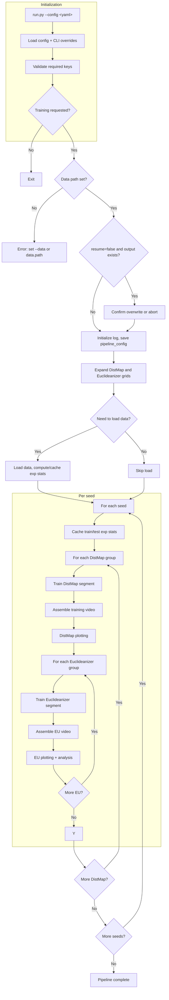
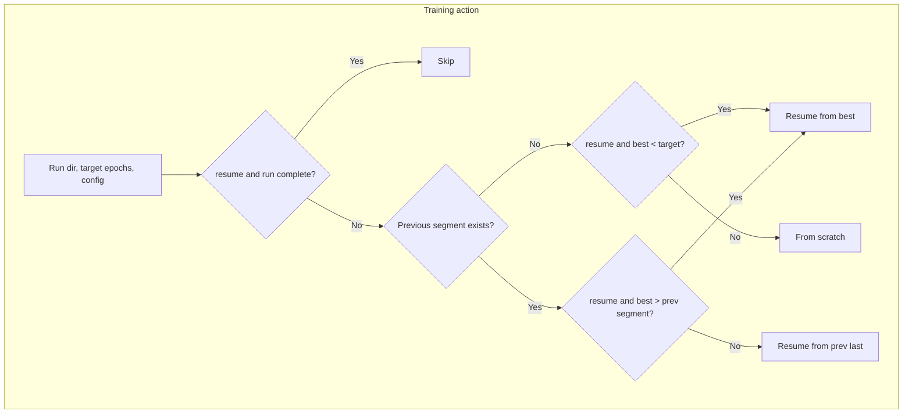
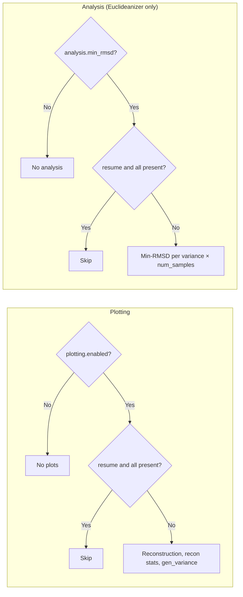

# Euclideanizer Pipeline — Flow and Options

This document describes the pipeline flow and all config/CLI options and outcomes. It is the single source of truth for pipeline structure when adding features (e.g. analysis) or parallelization.

---

## 1. High-level pipeline flow



---

## 2. Config and CLI reference

| Source | Effect |
|--------|--------|
| **data.split_seed** | Single int → one run under `output_dir`. List → one full pipeline per seed under `base_output_dir/seed_<n>/`. |
| **data.path** | Required for training. Used for train/test split and all plotting/analysis. |
| **data.training_split** | Fraction for train (e.g. 0.8); same for DistMap, Euclideanizer, plotting, analysis. |
| **distmap** (any key single or list) | Cartesian product → one DistMap run per combination. List for `epochs` → multi-segment training (e.g. 50, 100). |
| **euclideanizer** (any key single or list) | One Euclideanizer run per (DistMap run × euclideanizer combination). Same epoch-segment logic. |
| **plotting.enabled** | If false (or `--no-plots`), no plotting. |
| **plotting.reconstruction / bond_rg_scaling / avg_gen_vs_exp** | Toggle reconstruction, Rg/scaling stats, and gen-vs-exp plots. |
| **plotting.sample_variance** | List → one gen_variance plot set per value. |
| **training_visualization.enabled** | One MP4 per DistMap and per Euclideanizer run (requires ffmpeg). |
| **analysis.min_rmsd** | If true, min-RMSD analysis after each Euclideanizer (per variance × num_samples). |
| **analysis.min_rmsd_num_samples** | Int or list → one min_rmsd figure set per value. |
| **analysis.min_rmsd_sample_variance** | Float or list → one min_rmsd figure set per value. |
| **resume** | If true: skip complete runs and existing plot/analysis outputs. If false: confirm then delete output_dir and run from scratch. |

---

## 3. Training action (per segment)

Each DistMap and Euclideanizer segment is assigned one of four actions. Same logic for both; Euclideanizer uses `euclideanizer.pt` / `euclideanizer_last.pt`.



---

## 4. Plotting and analysis conditions



---

## 5. Output layout

```
base_output_dir/
├── pipeline_config.yaml
├── pipeline.log
├── experimental_statistics/
│   ├── meta.json
│   └── exp_stats.npz
└── seed_<s>/
    ├── pipeline_config.yaml
    ├── experimental_statistics/
    │   ├── split_meta.json
    │   ├── exp_stats_train.npz
    │   ├── exp_stats_test.npz
    │   └── test_to_train_rmsd.npz   # if analysis.min_rmsd & save_data
    └── distmap/<i>/
        ├── model/
        │   ├── run_config.yaml
        │   ├── model.pt
        │   └── model_last.pt        # if multi-segment
        ├── plots/
        │   ├── reconstruction/
        │   ├── recon_statistics/
        │   ├── gen_variance/
        │   │   └── structures/      # if save_structures_gro
        │   └── training_video/
        │       └── training_evolution.mp4
        └── euclideanizer/<j>/
            ├── model/
            │   ├── run_config.yaml
            │   ├── euclideanizer.pt
            │   └── euclideanizer_last.pt
            ├── plots/
            └── analysis/min_rmsd/<run_name>/
                ├── min_rmsd_distributions.png
                ├── data/            # if save_data
                └── structures/      # if save_structures_gro
```

---

## Viewing and exporting

- **Preview**: Mermaid blocks render in GitHub, GitLab, and in VS Code/Cursor with a Mermaid extension. For an editor, paste a block into [Mermaid Live](https://mermaid.live/).
- **Export**: In Mermaid Live use Export → PNG/SVG, or from the repo: `npx -y @mermaid-js/mermaid-cli -i PIPELINE_FLOWCHART.md -o pipeline_flowchart.png` (requires Node).

When you add analysis features or seed-level parallelization, update this document so the flow and options stay accurate.
