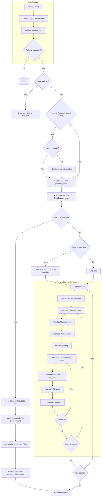
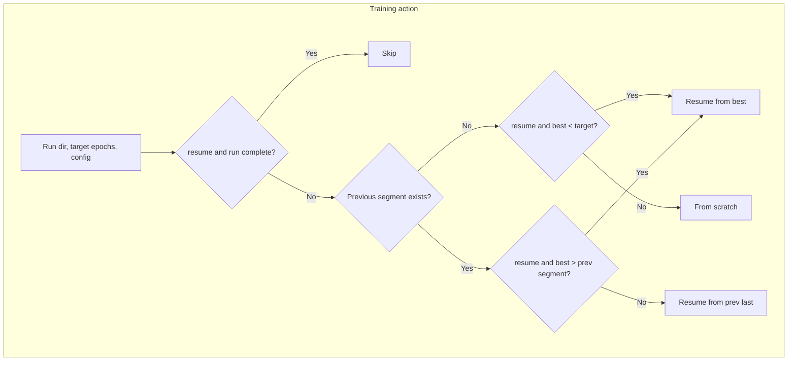
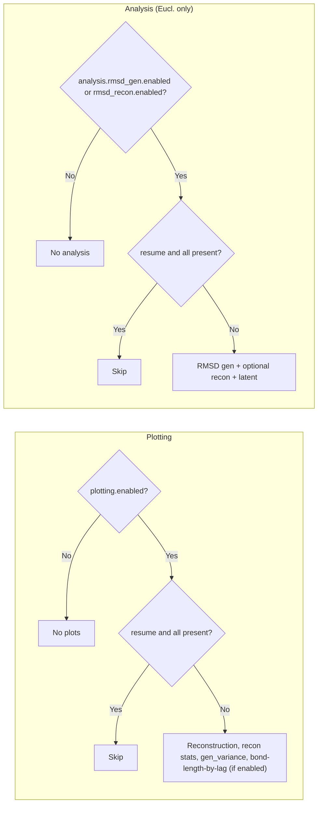

# Euclideanizer Pipeline

A self-contained pipeline for training **DistMap** (a distance-map VAE) and **Euclideanizer** (a model that maps non-Euclidean distance maps to 3D coordinates). One entrypoint runs training, evaluation, and default plotting. Suitable for any use case where you have structural ensembles (e.g. molecular dynamics, structural biology) and want a latent representation plus Euclideanization for downstream analysis or visualization.

---

## Overview

- **DistMap**: Variational autoencoder over pairwise distance matrices; encodes/decodes in a latent space.
- **Euclideanizer**: Takes the (non-Euclidean) decoded distance maps from the frozen DistMap and produces 3D coordinates so that their pairwise distances match the decoded map.

The pipeline trains one or more DistMap configurations, then for each trained DistMap trains one or more Euclideanizer configurations. All hyperparameters are driven by a single YAML config (with optional CLI overrides). Outputs include checkpoints, plots (reconstruction, statistics, generation), optional training videos, and optional analysis (e.g. RMSD, Q, Clustering).

---

## Requirements

- **Python** 3.9+
- **PyTorch** 2.0+ (CPU, CUDA, or MPS)
- **PyYAML**, **NumPy**, **Matplotlib**, **tqdm** (see `requirements.txt`)
- **ffmpeg** (optional): required to generate training videos
- **Multi-GPU**: Supported only with CUDA when 2+ devices are available; single-GPU and CPU runs are unchanged.

---

## Installation

From the pipeline directory:

```bash
pip install -r requirements.txt
```

No package install step for the pipeline itself; run the script from a working directory where the pipeline folder is available (see **Quick start**).

---

## Data format

The pipeline expects coordinate data as a single **NPZ file** with one required key:

- **`coords`** — array of shape `(n_structures, n_atoms, 3)` (float32 or float64; cast to float32 on load). The pipeline does not assume units; keep them consistent in your dataset.

To create a conforming file:

```python
import numpy as np
np.savez_compressed("my_data.npz", coords=coords)  # coords: (n_structures, n_atoms, 3)
```

- Input: path to a single `.npz` file (e.g. `data.npz`).
- The same train/test split (by `data.split_seed` and `data.training_split`) is used for training, validation, plotting, and analysis.

**Bundled dataset:** The project does not include large data files. All data-dependent use (smoke test, sample config, demos) relies on the **sphere dataset**: run `python tests/test_data/generate_spheres.py` to create `tests/test_data/spheres.npz`, then use it with the sample config or `--data tests/test_data/spheres.npz`. Regenerate or customize with optional args: `--num-structures`, `--beads`, `--output`.

**Setup wizard (raw data → NPZ):** If your data is in another format (e.g. PDB, XYZ, custom text), use the setup wizard to generate a custom converter script. It uses the Claude API to infer the format from a sample and writes a standalone Python script that produces a conforming NPZ file. Requires `ANTHROPIC_API_KEY` in the environment. From the pipeline directory:

```bash
python run_setup_wizard.py --data /path/to/your/file_or_directory [--output output.npz] [--max-files N] [--sample-lines N] [--confirm-large]
```

The wizard writes the converter to `setup_wizard_scripts/` and prints getting-started steps. Full wizard behavior and CLI options are described in the setup wizard specification included with the pipeline sources.

---

## Quick start

Run the pipeline from a directory that contains (or can see) the `Euclideanizer_Pipeline` folder. You must pass `**--config`** with the path to your YAML config; there is no default config file.

```bash
# From project root (replace with your paths)
python Euclideanizer_Pipeline/run.py --config Euclideanizer_Pipeline/samples/config_sample.yaml --data /path/to/coordinates.npz

# Or from inside the pipeline directory
python run.py --config samples/config_sample.yaml --data /path/to/coordinates.npz
```

Training requires a dataset path: set it with `--data` or in the config under `data.path`. All other options (output dir, hyperparameters, plotting, etc.) come from the config and can be overridden with CLI flags.

**Batch-size calibration:** Set `distmap.batch_size` and/or `euclideanizer.batch_size` to `null` to auto-calibrate at run time. Set `plotting.gen_decode_batch_size` or analysis blocks' **`gen_decode_batch_size`** to `null` to calibrate **decode** batch size from **VRAM** (inference); resolved value is written to `run_config.yaml` and reused on resume. **`query_batch_size`** in analysis blocks (RMSD, Q, etc.) is **not** calibrated: it must be set explicitly and limits **CPU RAM** use during analysis (e.g. Q matrix batch). Set it based on your system RAM to avoid OOM. **Training and inference batch sizes are independent:** you can set fixed training batch sizes and still leave gen_decode as `null` to calibrate decode only. Calibration uses a fixed GB safety margin (`calibration_safety_margin_gb`) and binary-search refinement steps (`calibration_binary_search_steps`). **Tip:** Maximum throughput and compute efficiency are achieved when using auto-calibration for gen_decode, but ideal *training* performance (e.g. validation loss) can be batch-size dependent. Use the batch-size benchmark (`tests/benchmark_batch_size.py`) to find the best training batch size for your hardware and data.

**Common options:**


| Goal                                                | Example                                                      |
| --------------------------------------------------- | ------------------------------------------------------------ |
| Training only (no plots)                            | `--no-plots`                                                 |
| Overwrite existing runs (wipe output dir, then run) | `--no-resume`                                                |
| Skip overwrite confirmation (for SLURM/scripts)     | `--yes-overwrite` (use with `--no-resume`)                   |
| Custom output directory                             | `--output-dir /path/to/output`                               |
| Override hyperparameters                            | `--distmap.beta_kl 0.01 0.05 --euclideanizer.epochs 150 300` |
| Disable multi-GPU                                   | `--no-multi-gpu` (run on one device even with 2+ GPUs)       |
| Limit GPUs used                                     | `--gpus N` (use at most N CUDA devices)                      |


### Hyperparameter optimization (HPO)

A separate entry point `**run_hpo.py`** runs Optuna-based joint optimization of DistMap and Euclideanizer parameters; the objective is the pipeline **overall score** (scoring module). Install Optuna (`pip install optuna`), then:

```bash
python run_hpo.py --config samples/hpo_config.yaml --data /path/to/coordinates.npz
```

Each trial runs the full pipeline (train DistMap → train Euclideanizer → plotting → analysis → scoring); validation loss is reported every epoch for pruning. To **resume** and run more trials:

```bash
python run_hpo.py --config samples/hpo_config.yaml --data /path/to/data.npz --resume --n-trials-add 50
```

**Resume behavior:** The study is loaded from the existing SQLite DB. Trials that were in progress when the run was stopped (or that failed) are **not** re-run; they remain in the study as incomplete/failed. Resume runs **new** trials until the total number of trials (complete, pruned, failed, or in progress) reaches the previous count plus `n_trials_add`. So you get additional trials, not a retry of interrupted ones.

**Multi-GPU:** The same command auto-uses all available GPUs. When more than one GPU is detected (or `n_gpus` in config is > 1), `run_hpo.py` spawns one worker per GPU sharing the same SQLite study DB; workers stop when total trials reach `n_trials`. Set `n_gpus` in config to limit (e.g. `n_gpus: 2`); omit or null to use all. For training videos (ffmpeg), **load the ffmpeg module in the same shell before starting** `run_hpo.py`; the launcher resolves ffmpeg and passes it to workers via `EUCLIDEANIZER_FFMPEG` so subprocesses see it even when PATH differs.

HPO config: `output_dir` (required), `data_path`, `seed`, `epoch_cap`, `pipeline_config`, `search_space`, `optuna` (n_trials, sampler, pruner, show_progress_bar), `n_gpus` (optional; null = use all GPUs). Study at `output_dir/hpo_study.db`; config saved to `output_dir/hpo_config.yaml` on first run; when adding trials, config must match except `n_trials` and `show_progress_bar`. **Logging:** `output_dir/trial_N/pipeline.log` per trial; `output_dir/hpo.log` for HPO summary. When a study run finishes, **`output_dir/dashboard/`** holds a small summary page: `index.html`, `manifest.json`, and **`assets/`** (stylesheet; same layout idea as the per-trial pipeline dashboard). The full HPO design (config schema, study DB, parallelism) is documented in the HPO specification included with the pipeline sources.

### Running on a cluster (SLURM)

An example SLURM job script is provided as `samples/run.sh`. It is a template with no user-specific paths: it runs from the pipeline root and uses `samples/config_sample.yaml`; job logs go to `slurm_logs/`. Edit the script to activate your Python environment and load any required modules (e.g. ffmpeg for training videos). For overwriting an existing run, add `--no-resume --yes-overwrite` to the `python run.py` line.

---

## Testing

Behavior tests live in `tests/test_pipeline_behavior.py`. They cover pipeline logic **without** running training, plotting, or analysis: they use a minimal config (`tests/config_test.yaml`), temporary directories, and the same helpers the main loop uses.

**What is tested**


| Area                         | Description                                                                                                                                                                                                                                                                                                                                                                              |
| ---------------------------- | ---------------------------------------------------------------------------------------------------------------------------------------------------------------------------------------------------------------------------------------------------------------------------------------------------------------------------------------------------------------------------------------- |
| **Run completion**           | A run is complete only when the best checkpoint exists, `last_epoch_trained` matches the target, and (for multi-segment) the last-epoch checkpoint is present when required. Final segment with `save_final_models_per_stretch: false` does not require the last checkpoint.                                                                                                             |
| **need_data**                | The pipeline loads only what is required. It must load *something* when the seed dir is missing, any run is incomplete, or (when enabled) a plot or analysis output is missing. It skips loading when all runs are complete and plot/analysis are disabled or already present. See **Resume and data loading** for coords-only vs stats-only vs full load.                               |
| **Resume logic**             | For both DistMap and Euclideanizer: **skip** when the run is complete; **from_scratch** when no previous run or `resume=False`; **resume_from_best** when the current run was interrupted (best epoch < target for first segment, or best > previous segment end for later segments); **resume_from_prev_last** when starting a new segment from the previous segment’s last checkpoint. |
| **Config**                   | Loading `config_test.yaml` yields valid training groups; if resume is on and the saved pipeline config in the output dir does not match the current config, the pipeline raises before loading data.                                                                                                                                                                                     |
| **Plotting / analysis skip** | When `resume=True` and all expected plot (or analysis) files exist, the pipeline skips loading the model for that run. Enabling **bond_length_by_genomic_distance** after `gen_variance` is already complete still runs the plotting phase (train/test split stats suffice; full-dataset `exp_stats` may not be reloaded).                                                                                                                                   |


**How to run**

From the pipeline directory:

```bash
pytest tests/test_pipeline_behavior.py -v
```

No dataset or GPU is required; tests use `tmp_path` and dummy checkpoints.

**Smoke test (full pipeline run)**

A single end-to-end smoke test runs the pipeline with a minimal config using `tests/test_data/spheres.npz` and a temporary output dir, then asserts that key outputs exist (DistMap and Euclideanizer checkpoints, `pipeline.log`). It is **included in default pytest runs** (`pytest tests/ -v`). **On one or zero GPUs** the test uses single-task (one seed); **on two or more GPUs** it uses multi-task (two seeds) so both devices are used and the multi-GPU path is exercised. The test is marked slow; to skip it for a quicker run, use `pytest -m "not slow"`.

- Run **all** tests including smoke (default): `pytest tests/ -v`
- Run all tests **except** smoke (quicker): `pytest tests/ -v -m "not slow"`
- Run **only** the smoke test: `pytest tests/test_smoke.py -v`

The smoke test requires `tests/test_data/spheres.npz` (e.g. from `python tests/test_data/generate_spheres.py`).

**Batch-size benchmark:** See **Benchmark and calibration** below for the full picture. Quick run: `python tests/benchmark_batch_size.py --config samples/config_sample.yaml --data /path/to/data.npz`

---

## Benchmark and calibration

This section describes how **in-run calibration** and the **batch-size benchmark script** work together, and how to interpret and configure them.

### Calibration (in-run, model-specific)

When `distmap.batch_size`, `euclideanizer.batch_size`, `plotting.gen_decode_batch_size`, or analysis blocks' **`gen_decode_batch_size`** are set to `null`, the pipeline **auto-calibrates** at run time so that training or decode stays within **GPU memory (VRAM)**. Calibration is **model-specific**: DistMap training, Euclideanizer training, and decode-only (inference) are calibrated separately; each uses a short probe (training step or forward pass) and a binary search over batch size. Resolved **gen_decode_batch_size** is written to `run_config.yaml` and reused on resume. **`query_batch_size`** (analysis) is **not** calibrated; set it in config based on **CPU RAM** so analysis steps (e.g. RMSD, Q) do not OOM.

- **Training vs inference are independent:** You can set fixed training batch sizes and still use `null` for gen_decode to calibrate decode only. Calibration uses `calibration_safety_margin_gb` (fixed GB reserved) and `calibration_binary_search_steps`; upper bounds are `calibration_training_batch_cap` and `calibration_decode_batch_cap`.
- **Rough goal:** Maximize throughput and avoid OOM. It does *not* optimize for validation loss or score; ideal training performance can depend on batch size and learning rate, which is where the benchmark helps.

### Batch-size benchmark (rough optimal for this config and dataset)

The script `tests/benchmark_batch_size.py` sweeps over **batch sizes** and **learning rates** (grid: batch_size × learning_rate) and reports wall-clock time per epoch, samples per second, final validation loss, and peak reserved VRAM for DistMap and/or Euclideanizer. It gives a **rough idea** of optimal training batch size and learning rate for a **given config and dataset**—useful when you want to tune beyond “whatever fits in memory.” The benchmark is **somewhat crude**: it runs a fixed number of epochs per (batch_size, learning_rate) and does not run the full pipeline (no plotting/analysis/scoring); it is intended for quick comparison, not as a substitute for full training.

- **Requires:** A pipeline YAML config (all required keys, including calibration), an NPZ dataset, and a GPU (recommended).
- **Modes:** `--mode dm|eu|both`. **dm** = DistMap only. **eu** = train a DistMap 50 epochs in a temp dir, run the Euclideanizer benchmark, then purge the temp dir. **both** = DistMap sweep then Euclideanizer sweep (if no `--dm-checkpoint`, a 5-epoch feeder DistMap is trained in a temp dir and purged).
- **Sweep:** `--batch-sizes 32 64 128 256`, `--learning-rates 1e-4 5e-4 1e-3` (default: one value from config per model), `--epochs 20`, `--dm-checkpoint /path/to/model.pt`, `--output benchmark_results.json`, `--device cuda:0`.
- **Output:** Printed tables per model and a JSON file with one record per (model, batch_size, learning_rate).

### Config used by the benchmark: single combination only

The benchmark **does not** run on the full combinatorial grid of distmap/euclideanizer options (e.g. multiple `latent_dim` or `epochs`). It uses **one** training configuration: for every key in `distmap` and `euclideanizer` that is a **list** in the config, the script takes the **first** value only. So you get one DistMap config and one Euclideanizer config; the only grid the script sweeps is batch_size × learning_rate (and only for the values you pass via `--batch-sizes` and `--learning-rates`).

If your config has lists (e.g. `latent_dim: [256, 512]` or `epochs: [100, 300]`), the script will **print a clear warning** that it is using the first combination and that results apply only to that combination. To optimize batch size or learning rate for a *different* set of hyperparameters, use a config where those options are **single values** (e.g. the one combination you care about). That keeps the benchmark simple and unambiguous.

---

## Configuration

### Config file

- **Path**: Required. Pass with `--config path/to/config.yaml` (no default; you must specify the config file and know where it is).
- **Content**: Every config key is required (no code-side defaults). All top-level sections and their keys must be present; see `samples/config_sample.yaml` and the **Config reference** below. Missing keys cause a clear error at load time.
- **Overrides**: CLI flags are merged over the config (e.g. `--distmap.epochs 100` replaces the config value).

### Key options (summary)


| Section                    | Purpose                                                                                                                                                                                                                                                                                                                                                                                                                                                                                                                                                                                                                                                                     |
| -------------------------- | --------------------------------------------------------------------------------------------------------------------------------------------------------------------------------------------------------------------------------------------------------------------------------------------------------------------------------------------------------------------------------------------------------------------------------------------------------------------------------------------------------------------------------------------------------------------------------------------------------------------------------------------------------------------------- |
| **data**                   | `path`, `split_seed` (int or list for multiple seeds), `training_split`                                                                                                                                                                                                                                                                                                                                                                                                                                                                                                                                                                                                     |
| **output_dir**             | Base directory for all outputs (each seed: `output_dir/seed_<n>/`)                                                                                                                                                                                                                                                                                                                                                                                                                                                                                                                                                                                                          |
| **distmap**                | VAE: `latent_dim`, `beta_kl`, `epochs`, `batch_size`, `learning_rate`, lambda weights, `memory_efficient`, `save_final_models_per_stretch`                                                                                                                                                                                                                                                                                                                                                                                                                                                                                                                                  |
| **euclideanizer**          | Same idea; no `latent_dim` (inherited from the frozen DistMap). Includes diagonal Wasserstein weights and `num_diags`.                                                                                                                                                                                                                                                                                                                                                                                                                                                                                                                                                      |
| **plotting**               | Same toggles and numeric params as above, plus **`plot_dpi`** (positive int) for PNG resolution on main plots and on RMSD/Q/clustering analysis figures. Then `max_train`, `max_test`, `save_data`, `save_pdf_copy`, `save_structures_gro`. Default in samples matches `src/plot_config.PLOT_DPI` (150).                                                                                                                                                                                                                                                                                                             |
| **training_visualization** | `enabled`, `n_probe`, `n_quick`, `gen_sample_variance`, `fps`, frame size/dpi, `delete_frames_after_video`                                                                                                                                                                                                                                                                                                                                                                                                                                                                                                                                                                  |
| **dashboard**              | `enabled` (when true, build interactive HTML report in `output_dir/dashboard/`).                                                                                                                                                                                                                                                                                                                                                                                                                                                                                                                                                                                            |
| **analysis**               | Top-level reference-size keys: `rmsd_max_train`, `rmsd_max_test`, `q_max_train`, `q_max_test`, `coord_clustering_max_*`, `distmap_clustering_max_*`, `**latent_max_train`**, `**latent_max_test**` (null = use all; int = cap reference set). Nested blocks: `rmsd_gen`, `rmsd_recon`, `q_gen`, `q_recon`, `generative_capacity_rmsd`, `generative_capacity_q`, `coord_clustering_*`, `distmap_clustering_*`, and `**latent**` (standalone; one plot set per Euclideanizer run under `analysis/latent/`; uses latent_max_train / latent_max_test). Recon blocks use `max_recon_train` / `max_recon_test` for how many structures to **reconstruct**. Analysis (RMSD, Q, generative capacity, clusterings, latent) runs on Euclideanizer outputs. **RMSD** figures and axis labels do not assume ångströms; values are in the same units as your coordinate NPZ. |
| **meta_analysis**          | `sufficiency`: `enabled`, `overwrite_existing`, `save_pdf_copy`. When enabled, reads existing **recon** RMSD/Q NPZ from Euclideanizer runs and writes per-seed figures under `output_dir/meta_analysis/sufficiency/` (stacked distributions per `max_data`, optional **curves** when ≥2 training splits, heatmaps). Runs near the end of the pipeline.                                                                                                                                                                                                                                                                     |
| **scoring**                | `enabled`, `overwrite_existing`, `save_pdf_copy`. When enabled, per-run scores and spider plot are written under `scoring/`; see **Scoring** subsection.                                                                                                                                                                                                                                                                                                                                                                                                                                                                                                                    |


### Scoring

When `**scoring.enabled`** is true, the pipeline runs **scoring after each block** (after plotting, after latent, and after each analysis metric—RMSD, Q, coord clustering, distmap clustering, generative capacity when enabled). Each run’s `**scoring/`** directory is updated with `**scores.json**` and a **spider/radar plot** (`scores_spider.png`; optional PDF when `**scoring.save_pdf_copy`** is true). Scores are computed from NPZ produced by plotting and analysis; the scheme is defined in the scoring specification shipped with the pipeline (z-score normalization, MAE/Wasserstein, geometric mean). The dashboard copies the spider image from `scoring/` into `dashboard/assets/` and shows it (and overall score) in the Detail view.

**Save-then-delete when scoring is on:** For scoring to run, the pipeline needs the NPZ that plotting/analysis write. If a block (e.g. plotting, or an analysis metric) has `**save_data: false`**, the pipeline still writes that block’s NPZ when scoring is enabled, so that scoring can read them. **After** scoring has run, the pipeline deletes each block’s NPZ according to that block’s own `save_data`: if `save_data` is false, that block’s data directory is removed. So you get one-time NPZ for scoring without keeping them when you don’t want saved data.

### Latent (analysis block)

**Latent** is one of the analysis blocks (`analysis.latent`). When enabled, it runs **first** in the analysis phase (before RMSD, Q, and clustering). The pipeline produces one set of latent plots per Euclideanizer run under `**analysis/latent/`** (e.g. `latent_distribution.png`, `latent_correlation.png`), using `max_train` and `max_test` from the latent config. The dashboard shows “Latent distribution” / “Latent correlation” per run when `analysis/latent/` exists.

- **Lists in config**: Any distmap or euclideanizer key except `batch_size` can be a list; the pipeline runs one job per element of the Cartesian product (e.g. `beta_kl: [0.01, 0.05]` and `epochs: [100, 300]` → 4 DistMap runs). `**batch_size` must be a single integer** in both distmap and euclideanizer (no list).
- **Epochs as list (segments)**: If `epochs` is a list (e.g. `[100, 300]`), the pipeline trains in segments: first to 100, then resume from the **last** epoch of that run and train to 300. Each segment gets its own run directory (e.g. `distmap/0/`, `distmap/1/`). The **best** checkpoint (by validation loss) is carried across segments. **Resume behavior**: (1) If a segment is interrupted (e.g. first segment stops at epoch 75 with best at 50), rerunning resumes from the **best** (50) and trains the remaining 50 epochs. (2) If a later segment is interrupted (e.g. 300-epoch run has best at 150 and stops at 250), rerunning resumes from the **best** (150) and trains the remaining 150 epochs. So the pipeline prefers resuming from the most recent of “previous segment’s last” or “current run’s best” when the best is more recent. The previous segment’s last checkpoint is deleted only **after** the current segment’s last is written (so a corrupted best save still has a fallback). When `**save_final_models_per_stretch`** is `false`, the **last** segment does not save a final-epoch checkpoint (no next segment needs it). Set `save_final_models_per_stretch` to `true` to keep each segment’s last checkpoint for inspection.
- **Euclideanizer ↔ DistMap**: For each trained DistMap, the pipeline trains one Euclideanizer run per Euclideanizer config combination; the correct frozen DistMap is chosen automatically.

---

## Pipeline behavior

### High-level flow




### Multi-GPU execution

When **2+ CUDA devices** are available, the pipeline splits work into independent **(seed, DistMap group)** tasks and runs them in parallel: one worker process per GPU, each running its assigned tasks sequentially on that device. No change to config or output layout; resume and overwrite rules are unchanged.

**Memory:** Each worker loads its own copy of the dataset and experimental statistics. The main process precomputes and caches per-seed train/test statistics, then frees its copy before spawning workers so that only the workers hold data (avoiding 1 + N copies and OOM). If you are still killed by the system (e.g. OOM killer) on large datasets, run with `**--no-multi-gpu`** or `**--gpus 1`** so only one copy is in memory.

**CPU RAM (host memory):** Multi-GPU runs use **CPU RAM** as well as GPU memory. Each worker keeps the full dataset in host memory and, during Euclideanizer plotting (e.g. recon_statistics, gen_variance), builds large NumPy arrays (e.g. full train/test reconstruction distance maps). With two workers doing heavy plotting or training at the same time, total host usage can exceed 64 GB on large runs; one worker may then block waiting for memory or the job may be killed. If one worker appears to stop making progress during Euclideanizer plotting (especially when resuming with only some plots present), **increase job CPU RAM** (e.g. 128–256 GB for 2 workers and thousands of structures). Alternatively run with `--no-multi-gpu` so only one process runs and peak CPU RAM is lower.

- **When it runs**: Automatically when `torch.cuda.is_available()` and `torch.cuda.device_count() >= 2`. Single-GPU and CPU (or MPS) runs use the same single-process loop as before.
- **Restrict devices**: Set `CUDA_VISIBLE_DEVICES` (e.g. `CUDA_VISIBLE_DEVICES=0,1`) to limit which GPUs are seen. You can also use `--no-multi-gpu` to force the single-process path, or `--gpus N` to use at most N devices.

### Config and CLI reference (flow)


| Source                                                                                           | Effect                                                                                                                                                                                                                                                                                                                                                                                  |
| ------------------------------------------------------------------------------------------------ | --------------------------------------------------------------------------------------------------------------------------------------------------------------------------------------------------------------------------------------------------------------------------------------------------------------------------------------------------------------------------------------- |
| **data.split_seed**                                                                              | Single int → one run under `output_dir`. List → one full pipeline per seed under `base_output_dir/seed_<n>/`.                                                                                                                                                                                                                                                                           |
| **data.path**                                                                                    | Required for training. Used for train/test split and all plotting/analysis.                                                                                                                                                                                                                                                                                                             |
| **data.training_split**                                                                          | Fraction for train (e.g. 0.8); same for DistMap, Euclideanizer, plotting, analysis.                                                                                                                                                                                                                                                                                                     |
| **distmap** (any key single or list except batch_size)                                           | Cartesian product → one DistMap run per combination. List for `epochs` → multi-segment training (e.g. 50, 100). `batch_size` is single value only.                                                                                                                                                                                                                                      |
| **euclideanizer** (any key single or list except batch_size)                                     | One Euclideanizer run per (DistMap run × euclideanizer combination). Same epoch-segment logic. `batch_size` is single value only.                                                                                                                                                                                                                                                       |
| **plotting.enabled**                                                                             | If false (or `--no-plots`), no plotting.                                                                                                                                                                                                                                                                                                                                                |
| **plotting.overwrite_existing**                                                                  | If true and plots exist: prompt then remove plots/dashboard up front and re-run plotting (use `--yes-overwrite` to skip prompt).                                                                                                                                                                                                                                                        |
| **plotting.reconstruction / bond_rg_scaling / avg_gen_vs_exp / bond_length_by_genomic_distance** | Toggle reconstruction, Rg/scaling stats, gen-vs-exp plots, and **three** pairwise-distance-by-lag grids (5×4): train exp vs recon train, test exp vs recon test, and train/test/gen overlay.                                                                                                                                                                                                                                                     |
| **plotting.sample_variance**                                                                     | List → one gen_variance plot set per value.                                                                                                                                                                                                                                                                                                                                             |
| **plotting.max_train / max_test**                                                                | Optional; `null` = use all train/test structures for reference statistics. An int caps **both** experimental and **reconstructed** structures in recon_statistics (so pairwise scoring compares matched counts). Same caps apply to exp side of gen_variance / bond_length_by_genomic_distance.                                                                                                                                                         |
| **analysis.rmsd_max_train / rmsd_max_test**                                                      | Optional; `null` = use all. Int = cap reference train/test set size for RMSD (gen and recon use the same reference). Large values can be slow (O(n²) pairwise work).                                                                                                                                                                                                                    |
| **analysis.q_max_train / q_max_test**                                                            | Optional; `null` = use all. Int = cap reference set for Q (gen and recon). Large values can be slow (O(n²) pairwise work).                                                                                                                                                                                                                                                              |
| **analysis.coord_clustering_max_train / coord_clustering_max_test**                              | Optional; `null` = use all. Int = cap reference set for coordinate-based clustering (gen and recon).                                                                                                                                                                                                                                                                                    |
| **analysis.distmap_clustering_max_train / distmap_clustering_max_test**                          | Optional; `null` = use all. Int = cap reference set for distance-map clustering (gen and recon).                                                                                                                                                                                                                                                                                        |
| **analysis.*.max_recon_train / max_recon_test**                                                  | In `rmsd_recon`, `q_recon`, `coord_clustering_recon`, `distmap_clustering_recon`: how many structures to **reconstruct**; independent of the shared reference-size caps above.                                                                                                                                                                                                          |
| **training_visualization.enabled**                                                               | One MP4 per DistMap and per Euclideanizer run (requires ffmpeg).                                                                                                                                                                                                                                                                                                                        |
| **training_visualization.gen_sample_variance**                                                   | Latent variance for the "Generated" Rg/scaling curve in the video (e.g. 1 to align with gen_variance plots).                                                                                                                                                                                                                                                                            |
| **analysis.rmsd_gen**                                                                            | Nested block: `enabled`, `overwrite_existing`, `num_samples`, `sample_variance`, `query_batch_size`, `save_data`, `save_pdf_copy`, `save_structures_gro`. If enabled, RMSD (gen) outputs under `analysis/rmsd/gen/<run>/`.                                                                                                                                                              |
| **analysis.rmsd_recon**                                                                          | Nested block: `enabled`, `overwrite_existing`, `max_recon_train`, `max_recon_test`, `save_data`, `save_pdf_copy`. If enabled, recon figure under `analysis/rmsd/recon/`. Latent is separate: **analysis.latent**.                                                                                                                                                                       |
| **analysis.q_gen**                                                                               | Nested block: `enabled`, `overwrite_existing`, `num_samples`, `sample_variance`, `delta`, `query_batch_size`, `save_data`, `save_pdf_copy`, `save_structures_gro`. Reference size from `analysis.q_max_train` / `q_max_test`. If enabled, max Q (gen) outputs under `analysis/q/gen/<run_name>/`. Default `delta`: 1/√2.                                                                |
| **analysis.generative_capacity_rmsd**                                                            | Nested block: `enabled`, `overwrite_existing`, `n_structures`, `gen_decode_batch_size`, `query_batch_size`, `save_data`, `save_pdf_copy`. Generates `n_max=max(n_structures)` structures, evaluates nested subsamples per `n`, and saves **one** figure `analysis/generative_capacity/rmsd/generative_capacity_rmsd.png`: **stacked filled** density histograms (one row per `n`, largest `n` at top; **`GEN_CAP_STACKED_*`**, **`HIST_BINS_DEFAULT`**, **`HIST_FILLED_EDGE_COLOR`**); **vertical** viridis colorbar for `log10(n)` when **≥2** values of `n`. X-axis label: min RMSD to nearest generated structure (**units = your coordinate units**, not labeled as Å). When **`save_data: true`**, writes **`data/n{N}_min_rmsd.npz`** per `n` **and** **`data/pairwise_matrix.npz`** (full `n_max×n_max` pairwise RMSD array **`pairwise`** plus `n_max`, `seed`, `n_structures`, `metric`). When **both** this block and **`generative_capacity_q`** are enabled, the pipeline also writes **`analysis/generative_capacity/convergence_median_vs_n_rmsd_q.png`** (two linear panels: median min RMSD vs `N`, median max Q vs `N`; both polylines **`COLOR_GEN`**). That file is part of “analysis complete” for resume. Overwriting **either** GC block removes the shared convergence PNG/PDF under `analysis/generative_capacity/` so it can be regenerated. |
| **analysis.generative_capacity_q**                                                               | Nested block: `enabled`, `overwrite_existing`, `n_structures`, `gen_decode_batch_size`, `query_batch_size`, `delta`, `save_data`, `save_pdf_copy`. Same flow as RMSD generative capacity but with max-Q; saves `analysis/generative_capacity/q/generative_capacity_q.png` (same layout). When **`save_data: true`**, **`data/n{N}_max_q.npz`** per `n` **and** **`data/pairwise_matrix.npz`** (full matrix + **`delta`**). See **`generative_capacity_rmsd`** row for the shared **convergence** figure and resume/overwrite behavior.                                                                 |
| **analysis.q_recon**                                                                             | Nested block: `enabled`, `overwrite_existing`, `max_recon_train`, `max_recon_test`, `delta`, `save_data`, `save_pdf_copy`. If enabled, max Q (recon) figure under `analysis/q/recon/`. Default `delta`: 1/√2.                                                                                                                                                                           |
| **analysis.coord_clustering_gen**                                                                | Nested block: `enabled`, `overwrite_existing`, `num_samples`, `sample_variance`, `n_subsample`, `query_batch_size`, `save_data`, `save_pdf_copy`. If enabled, coordinate RMSE–based clustering (gen) outputs under `analysis/coord_clustering/gen/<run_name>/` (pure_dendrograms, mixed_dendrograms, mixing_analysis, rmse_similarity). Uses pairwise RMSD in aligned-coordinate space. |
| **analysis.coord_clustering_recon**                                                              | Nested block: `enabled`, `overwrite_existing`, `max_recon_train`, `max_recon_test`, `n_subsample`, `save_data`, `save_pdf_copy`. If enabled, coord clustering (recon) figures under `analysis/coord_clustering/recon/`.                                                                                                                                                                 |
| **analysis.distmap_clustering_gen**                                                              | Nested block: `enabled`, `overwrite_existing`, `num_samples`, `sample_variance`, `n_subsample`, `query_batch_size`, `save_data`, `save_pdf_copy`. If enabled, distance-map upper-triangle RMSE clustering (gen) outputs under `analysis/distmap_clustering/gen/<run_name>/`.                                                                                                            |
| **analysis.distmap_clustering_recon**                                                            | Nested block: `enabled`, `overwrite_existing`, `max_recon_train`, `max_recon_test`, `n_subsample`, `save_data`, `save_pdf_copy`. If enabled, distmap clustering (recon) figures under `analysis/distmap_clustering/recon/`.                                                                                                                                                             |
| **analysis.latent**                                                                              | Standalone block (one per Euclideanizer run): `enabled`, `overwrite_existing`, `save_data`, `save_pdf_copy`. Uses top-level **latent_max_train** and **latent_max_test**. When enabled, writes `analysis/latent/latent_distribution.png`, `analysis/latent/latent_correlation.png`, and optionally `analysis/latent/data/latent_stats.npz`.                                             |
| **meta_analysis.sufficiency**                                                                   | Under **`meta_analysis:`** → **`sufficiency:`**: `enabled`, `overwrite_existing`, `save_pdf_copy`. **Plot-only** pass over completed runs: reads `analysis/rmsd/recon/.../rmsd_recon_data.npz` and matching `analysis/q/recon/.../q_recon_data.npz` (`test_recon_rmsd`, `test_recon_q`). Writes `meta_analysis/sufficiency/seed_<n>/distributions/max_data_*/distributions_rmsd_q.png`, optional **`curves/sufficiency_median_recon_vs_split_by_max_data.png`** (≥2 distinct `training_split` values), and **`heatmap/sufficiency_heatmap_rmsd_q.png`**. |
| **scoring**                                                                                      | `enabled`, `overwrite_existing`, `save_pdf_copy`. When enabled, after all runs the pipeline computes per-run scores from NPZ and writes `scoring/scores.json` and `scoring/scores_spider.png` in each Euclideanizer run dir. NPZ are written as needed for scoring then deleted per block’s `save_data`; see **Scoring** subsection.                                                    |
| **resume**                                                                                       | If true: skip complete runs and existing plot/analysis outputs. If false: confirm then delete output_dir and run from scratch (unless **--yes-overwrite**, which skips the prompt for non-interactive use).                                                                                                                                                                             |
| **CUDA devices**                                                                                 | If 2+ available: tasks (seed × DistMap group) run in parallel, one process per GPU. Use `--no-multi-gpu` to disable or `--gpus N` to cap device count.                                                                                                                                                                                                                                  |
| **--no-multi-gpu**                                                                               | Disable multi-GPU even when 2+ CUDA devices are available (single-process loop).                                                                                                                                                                                                                                                                                                        |
| **--gpus N**                                                                                     | Use at most N CUDA devices for multi-GPU (e.g. `--gpus 2` on a 4-GPU node).                                                                                                                                                                                                                                                                                                             |


### Order of operations

1. **Setup**: Load config, resolve paths, load dataset, compute or load cached **experimental statistics** (full-dataset and, per seed, train/test).
2. **Per seed** (if `data.split_seed` is a list): `output_dir = base_output_dir/seed_<n>`; train/test split uses that seed.
3. **Per DistMap segment** (each segment = one epoch target, e.g. 100 then 300):
  - Train DistMap (from scratch or resume previous segment) → save to `distmap/<i>/`.
  - If enabled: assemble training video from frames (or generate frames then assemble); optionally delete frames.
  - DistMap plotting: reconstruction, recon statistics (train + test), generation-variance plots, bond-length-by-genomic-distance (when enabled).
  - **Per Euclideanizer** (for this DistMap): for each epoch segment (e.g. 50 then 100):
    - Train Euclideanizer segment → save to `distmap/<i>/euclideanizer/<j>/`.
    - Assemble training video for this segment (if enabled).
    - Plotting (reconstruction, recon statistics, gen-variance, bond-length-by-genomic-distance when enabled) and analysis (e.g. min-RMSD) for this segment.
4. Repeat from step 3 for the next DistMap segment.
5. **End of pipeline** (after all seeds and Euclideanizer runs): optional **scoring** and NPZ cleanup per config; when **`meta_analysis.sufficiency.enabled`**, sufficiency figures under **`output_dir/meta_analysis/sufficiency/`**; when **`dashboard.enabled`**, the dashboard under **`output_dir/dashboard/`**.

So for DistMap `epochs: [300, 500]` and Euclideanizer `epochs: [50, 100]`: **DistMap 300** → video → plots → **EU** segment 50 (train → video → plots → analysis) → **EU** segment 100 (train → video → plots → analysis) → **DistMap 500** → same pattern, then meta-analysis and dashboard if enabled.

### Training action (per segment)

Each DistMap and Euclideanizer segment is assigned one of four actions. Same logic for both; Euclideanizer uses `euclideanizer.pt` / `euclideanizer_last.pt`.




### Plotting and analysis conditions




### Resume behavior

- **Default** (`resume: true`): Skip training a run if the checkpoint exists and the run is “complete” (see below). Also skip regenerating plot or analysis files that already exist.
- **Overwrite** (`resume: false` or `--no-resume`): If the output directory already exists, the pipeline prompts you to type `yes delete` and press Enter to confirm; anything else (or Ctrl+C) aborts without deleting. Once confirmed, the output directory is removed and the run starts from scratch. For **non-interactive runs** (e.g. SLURM), add `**--yes-overwrite`** to skip the prompt and avoid the job blocking on input.

**When is a run skipped?**

A run is skipped only if (1) the best checkpoint file exists, (2) the saved run config’s `last_epoch_trained` equals the expected max epochs (and the relevant config section matches), and (3) for multi-segment runs, the last-epoch checkpoint is required only when there is a **next** segment that needs it—i.e. on the **last** segment with `save_final_models_per_stretch: false`, the last-epoch file is not required (and is not written). If a run is incomplete (e.g. interrupted), the pipeline resumes from the run’s **best** checkpoint when that is available (within-segment or mid-segment resume), or from the previous segment’s **last** checkpoint when starting a new segment.

**Per-seed `pipeline_config.yaml`:** Each `seed_*` run directory includes a copy of the pipeline config (with that seed’s `data.split_seed`, `data.training_split`, and `data.max_data`). It is written as soon as the seed directory is created, **before** any seed-level caches under `experimental_statistics/`, so resume always has an on-disk config to compare (and root vs per-seed copies stay deliberately in sync).

**Resume and config mismatch:** If resume is on and the output directory already exists, **training-related** config (data, distmap, euclideanizer, training_visualization) must match the saved config exactly; otherwise the run fails with a diff. If **plotting** or **analysis** config differs, the pipeline handles each **chunk** independently: **Plotting**, **RMSD (gen)**, **RMSD (recon)**, **Q (gen)**, **Q (recon)**, **Generative Capacity (RMSD)**, **Generative Capacity (Q)**, **Coord clustering (gen)**, **Coord clustering (recon)**, **Distmap clustering (gen)**, **Distmap clustering (recon)**, **Latent**, and **Sufficiency Meta-Analysis** (`meta_analysis.sufficiency`). For each chunk whose config differs from saved, the pipeline prompts once to confirm, then removes only that chunk’s outputs, then re-runs that chunk (training is skipped). So if only the rmsd_recon block changed, you get one prompt and only recon analysis outputs are removed; plotting and rmsd_gen outputs are left intact. After any such updates, the saved pipeline config is overwritten with the current config.

**Overwriting only plotting or analysis:** You can re-run plotting or analysis over existing outputs without changing config by setting `**overwrite_existing: true`** in `plotting` or in an analysis sub-block (`rmsd_gen`, `rmsd_recon`, `q_gen`, `q_recon`, `generative_capacity_rmsd`, `generative_capacity_q`, `coord_clustering_gen`, `coord_clustering_recon`, `distmap_clustering_gen`, `distmap_clustering_recon`, `latent`, or **`meta_analysis.sufficiency`**). When that option is true and the corresponding outputs already exist, the pipeline prompts you to type `yes delete` to confirm; then it **deletes only those outputs up front** (plots/dashboard for plotting; that component’s analysis subdir only (e.g. `analysis/q/gen`); other metrics stay intact). **Generative capacity:** deleting **`generative_capacity_rmsd`** or **`generative_capacity_q`** also removes the shared **`analysis/generative_capacity/convergence_median_vs_n_rmsd_q.png`** (and `.pdf` if present) so the combined median-vs-`N` figure is not left stale. You are only prompted when output exists for that component, then re-runs them. This avoids mixing old and new results. Use `**--yes-overwrite`** to skip the prompt (e.g. in scripts).

**Reference-size (max_train/max_test) change:** If you change the number of train or test structures used for reference stats (e.g. `plotting.max_train`, `analysis.rmsd_max_train`, `q_max_train`, `coord_clustering_max_train`, `distmap_clustering_max_train`, or the corresponding `max_test` keys), and the run will use that component (plotting or that analysis), the pipeline **prompts** (same phrase as overwrite) and **removes the cached data** that depends on those values (per-seed train/test stats for plotting; test→train RMSD, Q, or clustering caches for analysis). Caches are then recomputed with the new limits so results stay correct. Use `--yes-overwrite` to skip the prompt. If `max_train` or `max_test` is larger than the number of available train or test structures, the pipeline uses all available (no error).

**Resume and data loading:** For replot-only runs (e.g. after config diff or overwrite_existing), the pipeline assumes the same inputs as for a full run: the **root dataset file** (`data.path` / `--data`, e.g. the .npz) when any step needs coordinates, and the **experimental_statistics caches** when it can do a stats-only load (e.g. only gen_variance missing). If the .npz is moved or the caches are missing/invalid, the run can fail when it tries to load. What gets loaded is tied to which outputs are missing:

- **Coords only:** When only training, reconstruction plots, recon_statistics, or RMSD analysis are missing, the pipeline loads the coordinate dataset and (if needed) computes or reuses train/test statistics from cache. It does *not* compute or load full experimental statistics (exp_stats) when only those outputs are needed.
- **Stats only (no coords):** When only gen_variance or bond_length_by_genomic_distance plots are missing and the base experimental-statistics cache plus every seed’s train/test split cache are present and valid, the pipeline loads only those caches (no coordinate file). It then regenerates the missing plots from the saved models. If any cache is missing or invalid, it falls back to a full load.
- **Full load:** When both coords-dependent and stats-dependent outputs are missing, or when stats-only is not possible, the pipeline loads the dataset and (if plotting/analysis need them) experimental statistics and train/test stats.
- **No load:** When all runs are complete and all plot/analysis outputs are present (e.g. you only run to assemble training videos from existing frames), nothing is loaded.

**Q metric (max Q):** The Q analysis blocks use a pairwise-distance similarity score **Q(α, β)** = (1/N) × Σ_{i<j} exp(−(r_ij(α) − r_ij(β))²/(2δ²)), where r_ij are pairwise distances (upper triangle, no diagonal), N = n_beads×(n_beads−1)/2, and **δ** is configurable (default **1/√2** so 2δ² = 1). Q is in [0, 1]; higher means more similar. For each query structure the pipeline reports **max Q** (best match over reference structures). All Q plot labels and outputs use “max Q”.

Experimental statistics are cached under `output_dir/experimental_statistics/` (full) and `output_dir/seed_<n>/experimental_statistics/` (train/test). They are reused when the dataset path, dimensions, and (for split caches) `max_train`/`max_test` match. Test→train RMSD is cached at seed level (`test_to_train_rmsd.npz` or `test_to_train_rmsd_{max_train}_{max_test}.npz` when limits are set): it is **saved whenever it is computed** (i.e. whenever RMSD analysis runs for that seed), **independent of the analysis block’s `save_data`**. Similarly, **max Q** uses `q_test_to_train.npz` (when both null) or `q_test_to_train_{max_train}_{max_test}.npz` and coord clustering uses `coord_clustering_train_test_feats_n{n}[_{max_train}_{max_test}].npz` and distmap clustering uses `distmap_clustering_train_test_feats_n{n}[_{max_train}_{max_test}].npz`. Gen and recon share the same reference; recon's `max_recon_`* only control how many structures are reconstructed. That cache is reused for all analyses in that seed with the same reference sizes (including when `overwrite_existing` re-runs analysis) and is not duplicated in the per-run analysis data dirs. The **per-run** analysis outputs (e.g. RMSD gen/recon `.npz` under `analysis/rmsd/.../data/`, `q_data.npz`, `q_recon_data.npz`) are still controlled by `save_data`.

---

## Output

### Directory structure

All outputs live under `output_dir` (from config or `--output-dir`). With multiple seeds, each uses `output_dir/seed_<n>/`. When `data.training_split` is a list (multiple values), each (seed, split) pair uses `output_dir/seed_<n>_split_<frac>/` instead of `seed_<n>/` for that pair.

- **Log**: `output_dir/pipeline.log` — concise, real-time log (elapsed time per line). Use `tail -f output_dir/pipeline.log` to monitor.
- **Experimental statistics cache**: `output_dir/experimental_statistics/` (full dataset) and per-seed under `output_dir/seed_<n>/experimental_statistics/` (train/test). Reused when path, dataset size, and (for split caches) plotting/analysis `max_train`/`max_test` match. Per-seed: `split_meta.json` + train/test npz for plotting reference stats; `test_to_train_rmsd[_{mt}_{mc}].npz` for RMSD; `q_test_to_train.npz` or `q_test_to_train_{mt}_{mc}.npz` for Q; `coord_clustering_train_test_feats_n{n}[_{mt}_{mc}].npz` and `distmap_clustering_train_test_feats_n{n}[_{mt}_{mc}].npz` for coord/distmap clustering (saved whenever used, independent of analysis `save_data`).
- **DistMap run**: `output_dir/seed_<n>/distmap/<i>/`
  - `model/model.pt` (best), `model/model_last.pt` (last epoch; present only when there is a next segment or `save_final_models_per_stretch: true`), `model/run_config.yaml`
  - `plots/reconstruction/`, `plots/recon_statistics/`, `plots/gen_variance/`, `plots/bond_length_by_genomic_distance_{train,test,gen}/` (when enabled), `plots/loss_curves/`
  - `training_video/` (frames and `training_evolution.mp4`) — separate from `plots/` so a plotting wipe does not remove it
- **Euclideanizer run**: `output_dir/seed_<n>/distmap/<i>/euclideanizer/<j>/`
  - Same idea: `model/euclideanizer.pt` (best), `model/euclideanizer_last.pt` (when not the last segment or `save_final_models_per_stretch: true`), `model/run_config.yaml`, plus the same plot types under `plots/`, and `training_video/` when enabled.
  - When **scoring.enabled** is true: `**scoring/`** with `scores.json` and `scores_spider.png` (and optional `scores_spider.pdf` when `scoring.save_pdf_copy` is true). The spider plot is generated by the scoring step; the dashboard only copies it into `dashboard/assets/`.
  - When RMSD (gen) is enabled: `analysis/rmsd/gen/<run_name>/` per (num_samples, variance), with `rmsd_distributions.png`, optional `data/`, optional `structures/`. When RMSD recon is enabled: `analysis/rmsd/recon/` with `rmsd_distributions.png`. When Q (gen) is enabled: `analysis/q/gen/<run_name>/` with `q_distributions.png` and optional `data/`, `structures/`. When Q (recon) is enabled: `analysis/q/recon/` (or `.../recon/<subdir>/` for multiple sizes) with `q_distributions.png`. When **generative capacity** RMSD and/or Q is enabled: `analysis/generative_capacity/rmsd/` and/or `analysis/generative_capacity/q/` with stacked `generative_capacity_*.png` and optional `data/` (per-`n` NPZ, pairwise matrix when `save_data: true`). When **both** RMSD and Q generative-capacity blocks are enabled: also `analysis/generative_capacity/convergence_median_vs_n_rmsd_q.png` (and optional PDF). When Coord clustering (gen) is enabled: `analysis/coord_clustering/gen/<run_name>/` with `pure_dendrograms.png`, `mixed_dendrograms.png`, `mixing_analysis.png`, `rmse_similarity.png`. When Coord clustering (recon) is enabled: `analysis/coord_clustering/recon/` (or `.../recon/<subdir>/`) with the same four figures. When Distmap clustering (gen) is enabled: `analysis/distmap_clustering/gen/<run_name>/` with the same four figures. When Distmap clustering (recon) is enabled: `analysis/distmap_clustering/recon/` (or `.../recon/<subdir>/`) with the same four figures. When **analysis.latent** is enabled: `analysis/latent/latent_distribution.png`, `analysis/latent/latent_correlation.png`, and optionally `analysis/latent/data/latent_stats.npz`.
  - When `plotting.save_structures_gro` is true, generated structures used for gen_variance plots are saved as one multi-frame GRO file per set under `plots/gen_variance/structures/<variance>/structures.gro` (Euclideanizer only; each structure is a frame/timestep).
- **Sufficiency meta-analysis** (when `meta_analysis.sufficiency.enabled`): under **`output_dir/meta_analysis/sufficiency/seed_<n>/`** — `distributions/max_data_*/distributions_rmsd_q.png`, optional **`curves/sufficiency_median_recon_vs_split_by_max_data.png`**, `heatmap/sufficiency_heatmap_rmsd_q.png` (plus PDFs when `save_pdf_copy: true`). Not inside a single Euclideanizer run; one tree per logical seed aggregated across `max_data` / `training_split` runs.

Index `i` is the run index in the expanded DistMap grid; `j` is the Euclideanizer config index. When `plotting.save_data` is true, many plots also write a `data/` subdir with `.npz` files (see **Saved plot data**).

When **dashboard.enabled** is true, the pipeline writes **dashboard/** in the run root (`output_dir/dashboard/`): `index.html`, `manifest.json`, and `assets/` (copies of plots and videos). When **scoring** has run, **Euclideanizer** figures show **Title Case** component score strips under each matching plot (not on DistMap-only outputs). **Bond length by genomic distance** also lists the recon **pairwise distance** scores. **Score Vs Aspect** view: pick an aspect (or training split) and a component score for a line/scatter plot, or check **Two Scores (Color By Aspect)** to plot one score on X and another on Y with point color by aspect; the color-key card sits **to the right** of the plot at the **same height** (narrow windows: horizontal scroll for the row). Hover shows full config. Open `index.html` in a browser for an interactive report. Views: **Browse** (hierarchical drill-down: one top-level entry per `seed_<n>/` or `seed_<n>_split_<frac>/` → DistMap → Euclideanizer, with full parameters at each level), **Meta-Analysis** (per seed: sufficiency **heatmap**, optional **median recon vs training split** curves, stacked **`distributions/max_data_*`** figures when `meta_analysis/sufficiency/` exists), **Detail** (single run with full parameter panel and all blocks; Euclideanizer runs include generative capacity stacked RMSD, stacked Q, **Generative Capacity (Median Vs N)** when the convergence PNG exists, then latent), **Compare** (side-by-side comparison of two DistMap runs or two Euclideanizer runs, with parameter panels and “Set as A” / “Set as B” from Browse or Detail), **Vary aspect** (sweep one parameter on the x-axis with full context config per row; horizontal scroll when needed). When several **train/test splits** are present (`seed_<n>_split_<frac>/` trees or multiple distinct `data.training_split` values reflected in saved configs), **training_split (train / test)** appears as an aspect: columns are train fractions, rows are fixed seed + DistMap/Euclideanizer index + model params. **Radar grid** (grid of all scored runs’ radar plots, ordered best-to-worst by overall score; hover a cell to see that run’s parameters). **Euclideanizer Detail** block order follows the **analysis** config: clusterings → generative capacity (stacked RMSD, stacked Q, median-vs-`N` convergence when present) → latent. **Seed**-level rows additionally show the sufficiency heatmap block when `meta_analysis/sufficiency/` exists. **Meta-Analysis** is a separate full-page view (heatmap, curves, distributions). To rebuild the dashboard after a run that skipped it, run: `python -m src.dashboard <output_dir>` from the Pipeline directory.

### Example tree (2 DistMap runs, 2 Euclideanizer configs)

```
output_dir/
  pipeline_config.yaml
  pipeline.log
  experimental_statistics/
  meta_analysis/          # when meta_analysis.sufficiency.enabled: sufficiency/seed_*/heatmap, distributions/, curves/
  seed_0/
    pipeline_config.yaml
    experimental_statistics/
    distmap/
      0/  model/, plots/, training_video/, euclideanizer/
            0/  model/, plots/ (...), training_video/, scoring/ (scores.json, scores_spider.png when scoring.enabled), analysis/rmsd/gen/<run_name>/ (...), analysis/rmsd/recon/ (...), analysis/q/..., analysis/coord_clustering/..., analysis/distmap_clustering/...
            1/  ...
      1/  model/, plots/, euclideanizer/
            0/  ...
            1/  ...
```

### Detailed output layout

```
base_output_dir/
├── pipeline_config.yaml
├── pipeline.log
├── dashboard/             # when dashboard.enabled: index.html, manifest.json, assets/
├── meta_analysis/         # when meta_analysis.sufficiency.enabled
│   └── sufficiency/
│       └── seed_<s>/
│           ├── distributions/max_data_*/distributions_rmsd_q.png
│           ├── curves/sufficiency_median_recon_vs_split_by_max_data.png   # when ≥2 training_split values
│           └── heatmap/sufficiency_heatmap_rmsd_q.png
├── experimental_statistics/
│   ├── meta.json
│   └── exp_stats.npz
└── seed_<s>/
    ├── pipeline_config.yaml
    ├── experimental_statistics/
    │   ├── split_meta.json
    │   ├── exp_stats_train.npz
    │   ├── exp_stats_test.npz
    │   ├── test_to_train_rmsd.npz   # when RMSD analysis runs; always saved when used (independent of save_data)
    │   └── q_test_to_train.npz or q_test_to_train_{max_train}_{max_test}.npz   # when Q analysis runs; always saved when used (independent of save_data)
    └── distmap/<i>/
        ├── model/
        │   ├── run_config.yaml
        │   ├── model.pt
        │   └── model_last.pt        # if multi-segment
        ├── plots/
        │   ├── reconstruction/
        │   ├── recon_statistics/
        │   ├── gen_variance/
        │   ├── bond_length_by_genomic_distance_{train,test,gen}/   # when plotting.bond_length_by_genomic_distance
        │   │   └── structures/      # if save_structures_gro
        │   └── loss_curves/
        ├── training_video/          # separate from plots/ so plotting wipe does not remove it
        │   ├── frames/
        │   └── training_evolution.mp4
        └── euclideanizer/<j>/
            ├── model/
            │   ├── run_config.yaml
            │   ├── euclideanizer.pt
            │   └── euclideanizer_last.pt
            ├── plots/
            ├── training_video/     # when enabled
            ├── scoring/            # when scoring.enabled: scores.json, scores_spider.png, optional scores_spider.pdf
            └── analysis/
                ├── rmsd/
                │   ├── gen/<run_name>/
                │   │   ├── rmsd_distributions.png
                │   │   ├── data/        # if save_data
                │   │   └── structures/  # if save_structures_gro
                │   └── recon/
                │       ├── rmsd_distributions.png
                │       ├── data/        # if save_data
                ├── generative_capacity/
                │   ├── rmsd/generative_capacity_rmsd.png, q/generative_capacity_q.png
                │   ├── convergence_median_vs_n_rmsd_q.png   # when both RMSD and Q GC blocks enabled
                │   └── rmsd/data/, q/data/                  # when save_data (per-n NPZ, pairwise_matrix.npz)
                ├── latent/      # when analysis.latent enabled: latent_distribution.png, latent_correlation.png, data/latent_stats.npz
                └── q/
                    ├── gen/<run_name>/
                    │   ├── q_distributions.png
                    │   ├── data/        # if save_data (q_data.npz)
                    │   └── structures/  # if save_structures_gro
                    └── recon/   # or recon/<subdir>/ for multiple (max_recon_train, max_recon_test)
                        ├── q_distributions.png
                        ├── data/        # if save_data (q_recon_data.npz)
```

---

## Project layout

```
Euclideanizer_Pipeline/
  run.py                 # Single entrypoint: training, plotting, analysis
  run_setup_wizard.py    # Setup wizard: raw data → NPZ (requires ANTHROPIC_API_KEY)
  requirements.txt
  README.md
  LICENSE
  setup_wizard_scripts/  # Generated converter scripts from setup wizard (created on first run)
  samples/
    run.sh               # Example SLURM job script (template; edit venv and modules for your cluster)
    config_sample.yaml   # Example config (all required keys)
  tests/
    test_pipeline_behavior.py  # Behavior tests (run completion, need_data, resume, config)
    test_utils_and_config.py  # Config, utils, metrics, rmsd, plot paths
    test_smoke.py             # Full pipeline smoke run (slow; requires tests/test_data/spheres.npz)
    benchmark_batch_size.py   # Batch-size sweep: efficiency and efficacy vs batch size (standalone script)
    conftest.py               # Pytest markers (e.g. slow)
    config_test.yaml          # Minimal config for behavior tests (no dataset required)
    config_smoke.yaml         # Minimal config for smoke test (2 seeds in config; test uses 1 seed on 1 GPU, 2 on 2+ GPUs)
    test_data/                # Bundled sphere dataset: generate_spheres.py, spheres.npz (after generation)
  src/
    _worker_main.py      # Multi-GPU worker launcher (used by run.py when 2+ GPUs)
    config.py            # Config load, validation, grid expansion
    utils.py             # Data loading (NPZ), device, distance maps, tri/symmetric helpers
    metrics.py           # Experimental statistics (bonds, Rg, scaling)
    plotting.py           # Reconstruction, recon stats, gen analysis, bond-length-by-genomic-distance, loss curves
    train_distmap.py     # One DistMap training run
    train_euclideanizer.py
    rmsd.py              # RMSD analysis (optional, via analysis.rmsd_gen / rmsd_recon)
    q_analysis.py        # Q / max Q analysis (optional, via analysis.q_gen / q_recon)
    generative_capacity.py  # Generative capacity (RMSD/Q stacked histograms + median-vs-N convergence when both enabled)
    meta_analysis.py     # Sufficiency meta-analysis (distributions, curves, heatmaps under meta_analysis/sufficiency/)
    clustering.py        # Coord and distmap clustering / dendrogram analysis (optional, via analysis.coord_clustering_* / distmap_clustering_*)
    gro_io.py            # Write 3D structures to GROMACS GRO format
    wizard.py            # Setup wizard logic (API, validation, save)
    wizard_prompts.py    # Setup wizard system and user prompt construction
    training_visualization.py  # Training videos (optional, requires ffmpeg)
    dashboard.py         # Interactive HTML dashboard (Browse, Meta-Analysis, Detail, Compare, Vary aspect, Radar grid, …)
    distmap/             # DistMap VAE (model, loss, sampling)
    euclideanizer/       # Euclideanizer model and frozen VAE loader
```

---

## Plots

When **plotting.enabled** is true, the pipeline produces the following figures under each run’s `plots/` directory. All use the same train/test split and (when applicable) the same cached train/test/generated statistics as other pipeline steps.

### Plot types


| Plot                                | Description                                                                                                                                                                                                                                                                          |
| ----------------------------------- | ------------------------------------------------------------------------------------------------------------------------------------------------------------------------------------------------------------------------------------------------------------------------------------ |
| **Reconstruction**                  | Test-set samples: original vs reconstructed (DistMap) or original / VAE decode / Euclideanizer (Euclideanizer).                                                                                                                                                                      |
| **Recon statistics**                | Bond lengths, radius of gyration, genomic scaling: experimental vs reconstruction. Separate figures for **test** and **train** subsets.                                                                                                                                              |
| **Generation (gen variance)**       | For each `plotting.sample_variance`: distributions (bonds, Rg, scaling) for full/train/test/generated; row of average distance maps (train, test, gen); row of difference maps (test−train, train−gen, test−gen).                                                                    |
| **Pairwise distance by lag** | When `plotting.bond_length_by_genomic_distance: true`: three 5×4 grids — (1) train experimental vs recon train, (2) test experimental vs recon test, (3) train, test, and gen overlay (**Gen** filled, **Train/Test** step). Gen variance bond/Rg panels use the same Gen-filled style. Up to 20 evenly spaced lags k per figure. |
| **Loss curves**                     | Train and validation loss per epoch (saved under `plots/loss_curves/`).                                                                                                                                                                                                              |


## Analysis

The pipeline supports **pluggable analysis metrics**: RMSD, Q (max Q), clustering, **generative capacity**, and **latent**. Outputs live under `analysis/rmsd/...`, `analysis/q/...`, `analysis/coord_clustering/...`, `analysis/distmap_clustering/...`, `analysis/generative_capacity/...`, and `analysis/latent/...`. Each metric has a **gen** block (involving generated structures) and a **recon** block (train/test and their reconstructions), except generative capacity and latent (per-run only). The implementation uses a single metric-agnostic loop in `run.py` over a registry in `src/analysis_metrics.py` for several metrics; generative capacity and sufficiency meta-analysis have dedicated modules. **Distance-based** analysis (RMSD, generative-capacity RMSD, coord clustering) reports values in the **same units as your coordinate NPZ**; plot labels do not assume ångströms.

### RMSD (min-RMSD to reference)

- **Gen:** For each (DistMap, Euclideanizer) run, generate structures and compute the **minimum RMSD** of each generated (or test) structure to the training set (and optionally to the test set). Histograms show test→train, gen→train, gen→test. Outputs: `analysis/rmsd/gen/<run_name>/rmsd_distributions.png`, optional `data/`, optional `structures/`. Config: `analysis.rmsd_gen` (e.g. `num_samples`, `sample_variance`, `save_data`, `save_structures_gro`). Reference set size is capped by `analysis.rmsd_max_train` / `rmsd_max_test`.
- **Recon:** Reconstruct train and test structures; compute one-to-one RMSD (reconstructed vs original). One figure with test→train (reused from cache), train recon RMSD, test recon RMSD. Outputs: `analysis/rmsd/recon/rmsd_distributions.png`. Config: `analysis.rmsd_recon` (`max_recon_train`, `max_recon_test`, `save_data`, `save_pdf_copy`).

### Q (max Q, contact overlap)

- **Gen:** Same layout as RMSD gen but using **max Q** (contact overlap measure) instead of min-RMSD. Histograms: test→train, gen→train, gen→test. Outputs under `analysis/q/gen/<run_name>/`. Reference size from `analysis.q_max_train` / `q_max_test`. Config: `analysis.q_gen` (includes `delta`, default 1/√2).
- **Recon:** One figure with test→train max Q, train recon Q (one-to-one), test recon Q (one-to-one). Outputs under `analysis/q/recon/` (or `.../recon/<subdir>/` for multiple sizes). Config: `analysis.q_recon`.

### Clustering (dendrograms and mixing)

Clustering compares **train**, **test**, and **generated** (or, for recon, **train**, **train recon**, **test**, **test recon**) in distance-map space. Each structure is represented by the upper triangle of its pairwise distance matrix; the **distance** between two structures is the RMSE between those vectors. To keep runtimes and figure sizes manageable, each population is **subsampled** to at most **n_subsample** structures (default 150) using **farthest-point sampling (FPS)** in PCA space, so the dendrograms are built on a diverse subset.

- **Four figures** (gen: `analysis/coord_clustering/gen/<run_name>/` or `analysis/distmap_clustering/gen/<run_name>/`; recon: `analysis/coord_clustering/recon/` or `analysis/distmap_clustering/recon/` or `.../recon/<subdir>/` for each):
  - **pure_dendrograms.png** — One tree per population (e.g. Train only, Gen only, Test only). Each leaf is one subsampled structure; height is distance at which clusters are merged (UPGMA / average linkage). Figures omit matplotlib titles; the **c** (cophenetic correlation) coefficient is described in this README (correlation between original pairwise distances and tree-implied distances; c ∈ [0, 1]) but is not printed on the figure. Shows how spread out each population is internally.
  - **mixed_dendrograms.png** — 2×2 panels combining two or three populations (e.g. Train+Test, Train+Gen, Gen+Test, Train+Gen+Test). One tree per panel; leaves are colored by source. If the model captures the same landscape, sources tend to **interleave** in the tree. A line below each panel reports the **mixing** score (fraction of each point’s k-NN that are from a different source, vs expected under random) and the ratio; cophenetic **c** is not shown on the figure.
  - **mixing_analysis.png** — Bar chart of mixing scores (observed vs expected) for each combined population (e.g. Train+Test, Train+Gen). Each bar pair shows observed mixing (fraction of each point’s k-NN from a different source) and expected under random; the ratio is shown above the bars. No figure title; axis labels and legend identify the series.
  - **rmse_similarity.png** — Q–Q plots comparing **within-population** pairwise RMSE distributions (e.g. Train vs Gen). Each point is (RMSE at quantile in A, RMSE at quantile in B); point color indicates quantile (0–100%). Points on the diagonal mean the two populations have similar internal distance structure. Pearson correlation of the quantile-matched curves is not shown on the figure; see this README for interpretation.

Config: `analysis.coord_clustering_gen` / `analysis.coord_clustering_recon` — coordinate RMSE (pairwise RMSD in aligned-coordinate space); reference size from `analysis.coord_clustering_max_train` / `coord_clustering_max_test`. `analysis.distmap_clustering_gen` / `analysis.distmap_clustering_recon` — distance-map upper-triangle RMSE; reference size from `analysis.distmap_clustering_max_train` / `distmap_clustering_max_test`. Both use `n_subsample`, `save_data`, `save_pdf_copy`, and (for gen) `num_samples`, `sample_variance`. Seed-level cache in `experimental_statistics/` stores FPS-subsampled train/test features for reuse across runs. When `save_data` is true, a per-run `data/clustering_data.npz` is also written (see **Saved plot data**).

### Latent (analysis.latent)

The **analysis.latent** block is standalone (one set of plots per Euclideanizer run). It uses the same top-level reference-size keys as other analysis metrics: **latent_max_train** and **latent_max_test** at the top of the `analysis` section. When enabled it writes under `analysis/latent/`:

- **latent_distribution.png** — Box plots (train vs test) and mean/std per latent dimension.
- **latent_correlation.png** — Train vs test **mean** and **std** across dimensions, with dashed y=x and Pearson r and R².
- Optionally `data/latent_stats.npz` when `save_data` (or scoring) is true.

### Generative capacity (`generative_capacity_rmsd` / `generative_capacity_q`)

For each enabled block, the pipeline generates **`n_max = max(n_structures)`** structures once, builds the full **`n_max × n_max`** pairwise matrix (RMSD or Q), then evaluates **nested** subsets for each `n` in `n_structures`. Outputs:

- **Stacked figures:** `analysis/generative_capacity/rmsd/generative_capacity_rmsd.png` and/or `analysis/generative_capacity/q/generative_capacity_q.png` — one **filled** density row per `n` (largest `n` at top), vertical viridis colorbar for `log10(n)` when **≥2** distinct `n`. RMSD x-axis: min RMSD to nearest generated structure (user coordinate units).
- **Convergence (both blocks on):** `analysis/generative_capacity/convergence_median_vs_n_rmsd_q.png` — two **linear** panels (median min RMSD vs `N`, median max Q vs `N`); both lines use **`COLOR_GEN`** from `src/plot_config.py` (generated-structures color). On **resume**, the combined figure is rebuilt from per-`n` NPZ when **`save_data: true`** on both blocks, or by re-running GC if needed.

With **`save_data: true`**, each block writes `data/n{N}_min_rmsd.npz` or `data/n{N}_max_q.npz` plus `data/pairwise_matrix.npz`.

### Sufficiency meta-analysis (`meta_analysis.sufficiency`)

A **pure plotting** step after Euclideanizer runs. It scans `output_dir` for completed runs, loads **test-set reconstruction** RMSD and Q from recon analysis NPZ (`test_recon_rmsd`, `test_recon_q`), and writes aggregated figures under **`meta_analysis/sufficiency/seed_<n>/`**: stacked **distributions** per `max_data`, optional **curves** (median recon vs **training split**, one line per `max_data`, when ≥2 split values), and a **heatmap** over the `(max_data, training_split)` grid. Requires recon NPZ on disk (enable **`save_data`** on `rmsd_recon` / `q_recon`, or scoring retention).

### Saved plot data (.npz)

With `plotting.save_data: true`, many plots write a `data/` subdir with `*_data.npz`. Load in Python with `np.load("path.npz")`. Representative keys:


| Plot                                  | Keys (examples)                                                                                                                                                                                                                                                                                                                                                                                                                                                                                                                                                                                                                                |
| ------------------------------------- | ---------------------------------------------------------------------------------------------------------------------------------------------------------------------------------------------------------------------------------------------------------------------------------------------------------------------------------------------------------------------------------------------------------------------------------------------------------------------------------------------------------------------------------------------------------------------------------------------------------------------------------------------- |
| **Reconstruction** (DistMap)          | `original_dms`, `recon_dms`                                                                                                                                                                                                                                                                                                                                                                                                                                                                                                                                                                                                                    |
| **Reconstruction** (Euclideanizer)    | `original`, `vae`, `euclideanizer`                                                                                                                                                                                                                                                                                                                                                                                                                                                                                                                                                                                                             |
| **Recon statistics**                  | `exp_bonds`, `exp_rg`, `genomic_distances`, `exp_scaling`, `recon_bonds`, `recon_rg`, `recon_scaling`                                                                                                                                                                                                                                                                                                                                                                                                                                                                                                                                          |
| **Gen variance**                      | `sample_variance`, `full_bonds`, `train_bonds`, `test_bonds`, `gen_bonds`, `avg_train_map`, `avg_test_map`, `avg_gen_map`, `diff_test_train`, `diff_train_gen`, `diff_test_gen`, etc.                                                                                                                                                                                                                                                                                                                                                                                                                                                          |
| **Pairwise distance by lag**   | When enabled and `plotting.save_data: true`: per subdir `bond_length_by_genomic_distance_gen|train|test/data/` — gen figure: `train_k*`, `test_k*`, `gen_k*`; train figure: `train_exp_k*`, `train_recon_k*`; test figure: `test_exp_k*`, `test_recon_k*`.                                                                                                                                                                                                                                                                                                                                                                                                    |
| **Loss curves**                       | `epoch`, `train_loss`, `val_loss`                                                                                                                                                                                                                                                                                                                                                                                                                                                                                                                                                                                                              |
| **RMSD (gen)** (analysis)             | When `analysis.rmsd_gen.save_data: true`: data under `analysis/rmsd/gen/<run_name>/data/` with keys such as `gen_to_train`, `gen_to_test`, `bins`. Test→train RMSD is only at seed level (`experimental_statistics/test_to_train_rmsd.npz`), saved whenever analysis runs (independent of `save_data`).                                                                                                                                                                                                                                                                                                                                        |
| **RMSD (recon)** (analysis)           | When `analysis.rmsd_recon.save_data: true`: data under `analysis/rmsd/recon/data/` (or `.../recon/<subdir>/data/`) with keys such as `train_recon_rmsd`, `test_recon_rmsd`, `bins`. Test→train RMSD is at seed level only (saved when used).                                                                                                                                                                                                                                                                                                                                                                                                   |
| **Q (gen)** (analysis)                | When `analysis.q_gen.save_data: true`: `analysis/q/gen/<run_name>/data/q_data.npz` with keys `gen_to_train`, `gen_to_test`, `bins`. Test→train max Q is at seed level (`experimental_statistics/q_test_to_train.npz` or `q_test_to_train_{max_train}_{max_test}.npz`), saved whenever Q analysis runs (independent of `save_data`).                                                                                                                                                                                                                                                                                                                                     |
| **Q (recon)** (analysis)              | When `analysis.q_recon.save_data: true`: `analysis/q/recon/data/q_recon_data.npz` (or `.../recon/<subdir>/data/...`) with keys `train_recon_q`, `test_recon_q`, `bins`. Test→train max Q is at seed level only (saved when used).                                                                                                                                                                                                                                                                                                                                                                                                              |
| **Coord clustering** (gen or recon)   | When `analysis.coord_clustering_gen.save_data` or `analysis.coord_clustering_recon.save_data: true`: under `analysis/coord_clustering/gen/<run_name>/data/` or `analysis/coord_clustering/recon/` (or `.../recon/<subdir>/`) `data/clustering_data.npz` (same keys as below). Seed-level cache: `coord_clustering_train_test_feats_n{n}[_{mt}_{mc}].npz`.                                                                                                                                                                                                                                                                                      |
| **Distmap clustering** (gen or recon) | When `analysis.distmap_clustering_gen.save_data` or `analysis.distmap_clustering_recon.save_data: true`: under `analysis/distmap_clustering/gen/<run_name>/data/` or `analysis/distmap_clustering/recon/` (or `.../recon/<subdir>/`) `data/clustering_data.npz` with keys: per-source feature arrays (`training_feats`, `test_feats`, `generated_feats` for gen; `training_feats`, `test_feats`, `train_recon_feats`, `test_recon_feats` for recon), `n_subsample`, `k_mixing`, `linkage_method`, and `mixing_keys`, `mixing_obs`, `mixing_exp`, `mixing_ratio`. Seed-level cache: `distmap_clustering_train_test_feats_n{n}[_{mt}_{mc}].npz`. |
| **Generative capacity** (RMSD or Q) | When `save_data: true`: `analysis/generative_capacity/rmsd/data/n{N}_min_rmsd.npz` or `.../q/data/n{N}_max_q.npz` (`values`, `n`, `median`, `p25`, `p75`, `seed`) and `data/pairwise_matrix.npz` (`pairwise`, `n_max`, `seed`, `n_structures`, `metric`; Q includes `delta`). Used to rebuild **`convergence_median_vs_n_rmsd_q.png`** on resume when both blocks are enabled. |


---

## Config reference (condensed)

All keys below are **required** (no defaults in code). Omit any and the pipeline raises at load time.

- **resume**: `true` (skip complete runs) or `false` (overwrite after confirmation).
- **data**: `path` (dataset file), `split_seed` (int or list of ints), `training_split` (e.g. 0.8).
- **calibration**: `calibration_safety_margin_gb` (fixed GB reserved for calibration), `calibration_binary_search_steps` (max halving steps after OOM), `calibration_training_batch_cap` (upper bound for **training** batch-size search when `batch_size` is null).
- **distmap**: `latent_dim`, `beta_kl`, `epochs`, `batch_size`, `learning_rate`, `lambda_mse`, `lambda_w_recon`, `lambda_w_gen`, `memory_efficient`, `save_final_models_per_stretch`.
- **euclideanizer**: `epochs`, `batch_size`, `learning_rate`, same lambdas plus `lambda_w_diag_recon`, `lambda_w_diag_gen`, `num_diags` (diagonals for diagonal Wasserstein), `memory_efficient`, `save_final_models_per_stretch`.
- **plotting**: `enabled`, `overwrite_existing`, `reconstruction`, `bond_rg_scaling`, `avg_gen_vs_exp`, `bond_length_by_genomic_distance`, `num_samples`, `gen_decode_batch_size`, `sample_variance`, `num_reconstruction_samples`, **`plot_dpi`**, `max_train`, `max_test`, `save_data`, `save_pdf_copy`, `save_structures_gro`. (Key order standardized: behavior then save options.) **`plot_dpi`** controls PNG DPI for pipeline plots and analysis figures; `PLOT_DPI` in `plot_config.py` is the code default for functions that take an optional `dpi` argument.
- **training_visualization**: `enabled`, `n_probe`, `n_quick`, `gen_sample_variance`, `fps`, `frame_width`, `frame_height`, `frame_dpi`, `delete_frames_after_video`.
- **dashboard**: `enabled` (interactive HTML report in `output_dir/dashboard/` when true).
- **scoring**: `enabled`, `overwrite_existing`, `save_pdf_copy` (when true, save a PDF of the scores spider plot in dashboard assets).
- **meta_analysis**: **sufficiency** — `enabled`, `overwrite_existing`, `save_pdf_copy` (see **Sufficiency meta-analysis** above).
- **analysis**: Top-level reference-size keys: `rmsd_max_train`, `rmsd_max_test`, `q_max_train`, `q_max_test`, `coord_clustering_max_train`, `coord_clustering_max_test`, `distmap_clustering_max_train`, `distmap_clustering_max_test`, **latent_max_train**, **latent_max_test**. Nested blocks: **rmsd_gen**, **rmsd_recon**, **q_gen**, **q_recon**, **generative_capacity_rmsd**, **generative_capacity_q**, **coord_clustering_gen**, **coord_clustering_recon**, **distmap_clustering_gen**, **distmap_clustering_recon**, **latent** (standalone; uses latent_max_train / latent_max_test). **rmsd_recon** / **q_recon** / clustering recon: `enabled`, `overwrite_existing`, `max_recon_train`, `max_recon_test`, `save_data`, `save_pdf_copy` (no visualize_latent). **latent**: `enabled`, `overwrite_existing`, `save_data`, `save_pdf_copy`. **Generative capacity** blocks: `n_structures`, `gen_decode_batch_size`, `query_batch_size`, `save_data`, `save_pdf_copy`; Q adds **`delta`**.

For full structure and comments, use `samples/config_sample.yaml` as the template.