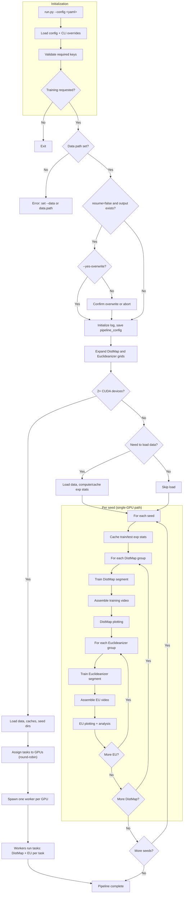
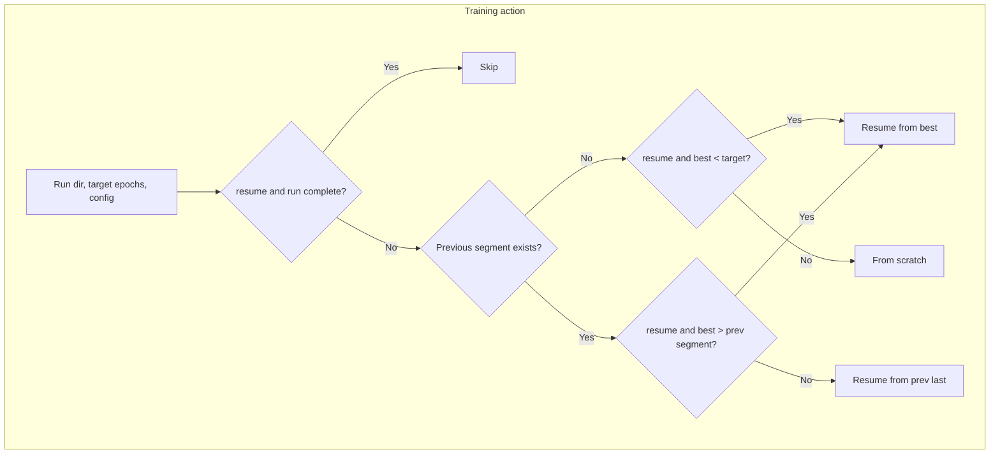
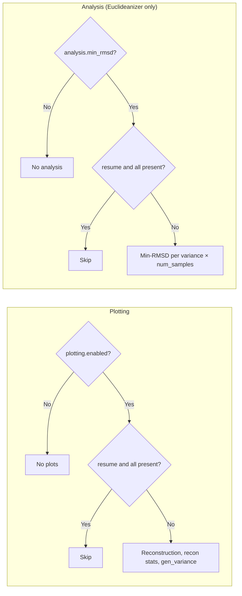

# Euclideanizer Pipeline

A self-contained pipeline for training **DistMap** (a distance-map VAE) and **Euclideanizer** (a model that maps non-Euclidean distance maps to 3D coordinates). One entrypoint runs training, evaluation, and default plotting. Suitable for any use case where you have structural ensembles (e.g. molecular dynamics, structural biology) and want a latent representation plus Euclideanization for downstream analysis or visualization.

---

## Overview

- **DistMap**: Variational autoencoder over pairwise distance matrices; encodes/decodes in a latent space.
- **Euclideanizer**: Takes the (non-Euclidean) decoded distance maps from the frozen DistMap and produces 3D coordinates so that their pairwise distances match the decoded map.

The pipeline trains one or more DistMap configurations, then for each trained DistMap trains one or more Euclideanizer configurations. All hyperparameters are driven by a single YAML config (with optional CLI overrides). Outputs include checkpoints, plots (reconstruction, statistics, generation), optional training videos, and optional analysis (e.g. min-RMSD).

---

## Requirements

- **Python** 3.9+
- **PyTorch** 2.0+ (CPU, CUDA, or MPS)
- **PyYAML**, **NumPy**, **Matplotlib**, **tqdm** (see `requirements.txt`)
- **ffmpeg** (optional): required to generate training videos
- **Multi-GPU**: Supported only with CUDA when 2+ devices are available; single-GPU and CPU runs are unchanged.

---

## Installation

From the pipeline directory (or project root that contains it):

```bash
pip install -r Euclideanizer_Pipeline/requirements.txt
```

No package install step for the pipeline itself; run the script from a working directory where the pipeline folder is available (see **Quick start**).

---

## Data format

The pipeline expects coordinate data as a **GRO-style text file**: one or more frames, each frame with a title line, an atom count, and then one line per atom (columns must include x, y, z coordinates). The default loader in `src/utils.py` looks for frame title lines starting with `"Chromosome"`; if your data uses a different convention, you will need to point to a compatible file or adapt the loader.

- Input: path to a single file (e.g. `data.gro`).
- Interpreted as: `(n_structures, n_atoms, 3)` array of coordinates.
- The same train/test split (by `data.split_seed` and `data.training_split`) is used for training, validation, plotting, and analysis.

**Bundled dataset:** The project does not include large chromosome GRO files. All data-dependent use (smoke test, sample config, demos) relies on the **sphere dataset**: run `python tests/test_data/generate_spheres.py` to create `tests/test_data/spheres.gro`, then use it with the sample config or `--data tests/test_data/spheres.gro`. Regenerate or customize with optional args: `--num-structures`, `--beads`, `--output`.

---

## Quick start

Run the pipeline from a directory that contains (or can see) the `Euclideanizer_Pipeline` folder. You must pass `**--config`** with the path to your YAML config; there is no default config file.

```bash
# From project root (replace with your paths)
python Euclideanizer_Pipeline/run.py --config Euclideanizer_Pipeline/config_sample.yaml --data /path/to/coordinates.gro

# Or from inside the pipeline directory
python run.py --config config_sample.yaml --data /path/to/coordinates.gro
```

Training requires a dataset path: set it with `--data` or in the config under `data.path`. All other options (output dir, hyperparameters, plotting, etc.) come from the config and can be overridden with CLI flags.

**Common options:**


| Goal                     | Example                                                      |
| ------------------------ | ------------------------------------------------------------ |
| Training only (no plots) | `--no-plots`                                                 |
| Overwrite existing runs (wipe output dir, then run) | `--no-resume`                 |
| Skip overwrite confirmation (for SLURM/scripts)     | `--yes-overwrite` (use with `--no-resume`) |
| Custom output directory  | `--output-dir /path/to/output`                               |
| Override hyperparameters | `--distmap.beta_kl 0.01 0.05 --euclideanizer.epochs 150 300` |
| Disable multi-GPU        | `--no-multi-gpu` (run on one device even with 2+ GPUs)       |
| Limit GPUs used         | `--gpus N` (use at most N CUDA devices)                     |

### Running on a cluster (SLURM)

An example SLURM job script is provided as `run.sh`. It is a template with no user-specific paths: it runs from the pipeline directory and writes job logs to `slurm_logs/`. Edit the script to activate your Python environment and load any required modules (e.g. ffmpeg for training videos). For overwriting an existing run, add `--no-resume --yes-overwrite` to the `python run.py` line.

---

## Testing

Behavior tests live in `tests/test_pipeline_behavior.py`. They cover pipeline logic **without** running training, plotting, or analysis: they use a minimal config (`tests/config_test.yaml`), temporary directories, and the same helpers the main loop uses.

**What is tested**

| Area | Description |
|------|-------------|
| **Run completion** | A run is complete only when the best checkpoint exists, `last_epoch_trained` matches the target, and (for multi-segment) the last-epoch checkpoint is present when required. Final segment with `save_final_models_per_stretch: false` does not require the last checkpoint. |
| **need_data** | The pipeline loads only what is required. It must load *something* when the seed dir is missing, any run is incomplete, or (when enabled) a plot or analysis output is missing. It skips loading when all runs are complete and plot/analysis are disabled or already present. See **Resume and data loading** for coords-only vs stats-only vs full load. |
| **Resume logic** | For both DistMap and Euclideanizer: **skip** when the run is complete; **from_scratch** when no previous run or `resume=False`; **resume_from_best** when the current run was interrupted (best epoch &lt; target for first segment, or best &gt; previous segment end for later segments); **resume_from_prev_last** when starting a new segment from the previous segment’s last checkpoint. |
| **Config** | Loading `config_test.yaml` yields valid training groups; if resume is on and the saved pipeline config in the output dir does not match the current config, the pipeline raises before loading data. |
| **Plotting / analysis skip** | When `resume=True` and all expected plot (or analysis) files exist, the pipeline skips loading the model for that run. |

**How to run**

From the pipeline directory:

```bash
pytest tests/test_pipeline_behavior.py -v
```

No dataset or GPU is required; tests use `tmp_path` and dummy checkpoints.

**Smoke test (full pipeline run)**

A single end-to-end smoke test runs the pipeline with a minimal config using `tests/test_data/spheres.gro` and a temporary output dir, then asserts that key outputs exist (DistMap and Euclideanizer checkpoints, `pipeline.log`). **With one GPU** it runs one seed (single task) for a faster check; **with two or more GPUs** it runs two seeds so both devices are used and the multi-GPU path is exercised. The test is marked as slow and is **skipped by default**.

- Run all tests **except** smoke: `pytest tests/ -v -m "not slow"`
- Run **only** the smoke test: `pytest tests/test_smoke.py -v` or `pytest tests/test_smoke.py -v -m slow`
- Run **all** tests including smoke: `pytest tests/ -v`

The smoke test requires `tests/test_data/spheres.gro` (e.g. from `python tests/test_data/generate_spheres.py`).


---

## Configuration

### Config file

- **Path**: Required. Pass with `--config path/to/config.yaml` (no default; you must specify the config file and know where it is).
- **Content**: Every config key is required (no code-side defaults). All top-level sections and their keys must be present; see `config_sample.yaml` and the **Config reference** below. Missing keys cause a clear error at load time.
- **Overrides**: CLI flags are merged over the config (e.g. `--distmap.epochs 100` replaces the config value).

### Key options (summary)


| Section                    | Purpose                                                                                                                |
| -------------------------- | ---------------------------------------------------------------------------------------------------------------------- |
| **data**                   | `path`, `split_seed` (int or list for multiple seeds), `training_split`                                                |
| **output_dir**             | Base directory for all outputs (each seed: `output_dir/seed_<n>/`)                                                     |
| **distmap**                | VAE: `latent_dim`, `beta_kl`, `epochs`, `batch_size`, `learning_rate`, lambda weights, `memory_efficient`, `save_final_models_per_stretch` |
| **euclideanizer**          | Same idea; no `latent_dim` (inherited from the frozen DistMap). Includes diagonal Wasserstein weights and `num_diags`. |
| **plotting**               | `enabled`, reconstruction / bond_rg_scaling / avg_gen_vs_exp, `num_samples`, `sample_variance`, `save_plot_data`, `save_structures_gro`, etc. |
| **training_visualization** | `enabled`, `n_probe`, `n_quick`, `fps`, frame size/dpi, `delete_frames_after_video`                                    |
| **analysis**               | `min_rmsd`, `min_rmsd_num_samples`, `min_rmsd_sample_variance`, `min_rmsd_query_batch_size`, `save_data`, `save_structures_gro` |


- **Lists in config**: Any distmap or euclideanizer key can be a list; the pipeline runs one job per element of the Cartesian product (e.g. `beta_kl: [0.01, 0.05]` and `epochs: [100, 300]` → 4 DistMap runs).
- **Epochs as list (segments)**: If `epochs` is a list (e.g. `[100, 300]`), the pipeline trains in segments: first to 100, then resume from the **last** epoch of that run and train to 300. Each segment gets its own run directory (e.g. `distmap/0/`, `distmap/1/`). The **best** checkpoint (by validation loss) is carried across segments. **Resume behavior**: (1) If a segment is interrupted (e.g. first segment stops at epoch 75 with best at 50), rerunning resumes from the **best** (50) and trains the remaining 50 epochs. (2) If a later segment is interrupted (e.g. 300-epoch run has best at 150 and stops at 250), rerunning resumes from the **best** (150) and trains the remaining 150 epochs. So the pipeline prefers resuming from the most recent of “previous segment’s last” or “current run’s best” when the best is more recent. The previous segment’s last checkpoint is deleted only **after** the current segment’s last is written (so a corrupted best save still has a fallback). When **`save_final_models_per_stretch`** is `false`, the **last** segment does not save a final-epoch checkpoint (no next segment needs it). Set `save_final_models_per_stretch` to `true` to keep each segment’s last checkpoint for inspection.
- **Euclideanizer ↔ DistMap**: For each trained DistMap, the pipeline trains one Euclideanizer run per Euclideanizer config combination; the correct frozen DistMap is chosen automatically.

---

## Pipeline behavior

### High-level flow



### Multi-GPU execution

When **2+ CUDA devices** are available, the pipeline splits work into independent **(seed, DistMap group)** tasks and runs them in parallel: one worker process per GPU, each running its assigned tasks sequentially on that device. No change to config or output layout; resume and overwrite rules are unchanged.

**Memory:** Each worker loads its own copy of the dataset and experimental statistics. The main process precomputes and caches per-seed train/test statistics, then frees its copy before spawning workers so that only the workers hold data (avoiding 1 + N copies and OOM). If you are still killed by the system (e.g. OOM killer) on large datasets, run with **`--no-multi-gpu`** or **`--gpus 1`** so only one copy is in memory.

- **When it runs**: Automatically when `torch.cuda.is_available()` and `torch.cuda.device_count() >= 2`. Single-GPU and CPU (or MPS) runs use the same single-process loop as before.
- **Restrict devices**: Set `CUDA_VISIBLE_DEVICES` (e.g. `CUDA_VISIBLE_DEVICES=0,1`) to limit which GPUs are seen. You can also use `--no-multi-gpu` to force the single-process path, or `--gpus N` to use at most N devices.

### Config and CLI reference (flow)

| Source | Effect |
|--------|--------|
| **data.split_seed** | Single int → one run under `output_dir`. List → one full pipeline per seed under `base_output_dir/seed_<n>/`. |
| **data.path** | Required for training. Used for train/test split and all plotting/analysis. |
| **data.training_split** | Fraction for train (e.g. 0.8); same for DistMap, Euclideanizer, plotting, analysis. |
| **distmap** (any key single or list) | Cartesian product → one DistMap run per combination. List for `epochs` → multi-segment training (e.g. 50, 100). |
| **euclideanizer** (any key single or list) | One Euclideanizer run per (DistMap run × euclideanizer combination). Same epoch-segment logic. |
| **plotting.enabled** | If false (or `--no-plots`), no plotting. |
| **plotting.reconstruction / bond_rg_scaling / avg_gen_vs_exp** | Toggle reconstruction, Rg/scaling stats, and gen-vs-exp plots. |
| **plotting.sample_variance** | List → one gen_variance plot set per value. |
| **training_visualization.enabled** | One MP4 per DistMap and per Euclideanizer run (requires ffmpeg). |
| **analysis.min_rmsd** | If true, min-RMSD analysis after each Euclideanizer (per variance × num_samples). |
| **analysis.min_rmsd_num_samples** | Int or list → one min_rmsd figure set per value. |
| **analysis.min_rmsd_sample_variance** | Float or list → one min_rmsd figure set per value. |
| **resume** | If true: skip complete runs and existing plot/analysis outputs. If false: confirm then delete output_dir and run from scratch (unless **--yes-overwrite**, which skips the prompt for non-interactive use). |
| **CUDA devices** | If 2+ available: tasks (seed × DistMap group) run in parallel, one process per GPU. Use `--no-multi-gpu` to disable or `--gpus N` to cap device count. |
| **--no-multi-gpu** | Disable multi-GPU even when 2+ CUDA devices are available (single-process loop). |
| **--gpus N** | Use at most N CUDA devices for multi-GPU (e.g. `--gpus 2` on a 4-GPU node). |

### Order of operations

1. **Setup**: Load config, resolve paths, load dataset, compute or load cached **experimental statistics** (full-dataset and, per seed, train/test).
2. **Per seed** (if `data.split_seed` is a list): `output_dir = base_output_dir/seed_<n>`; train/test split uses that seed.
3. **Per DistMap segment** (each segment = one epoch target, e.g. 100 then 300):
  - Train DistMap (from scratch or resume previous segment) → save to `distmap/<i>/`.
  - If enabled: assemble training video from frames (or generate frames then assemble); optionally delete frames.
  - DistMap plotting: reconstruction, recon statistics (train + test), generation-variance plots.
  - **Per Euclideanizer** (for this DistMap): for each epoch segment (e.g. 50 then 100):
    - Train Euclideanizer segment → save to `distmap/<i>/euclideanizer/<j>/`.
    - Assemble training video for this segment (if enabled).
    - Plotting (reconstruction, recon statistics, gen-variance) and analysis (e.g. min-RMSD) for this segment.
4. Repeat from step 3 for the next DistMap segment.

So for DistMap `epochs: [300, 500]` and Euclideanizer `epochs: [50, 100]`: **DistMap 300** → video → plots → **EU** segment 50 (train → video → plots → analysis) → **EU** segment 100 (train → video → plots → analysis) → **DistMap 500** → same pattern.

### Training action (per segment)

Each DistMap and Euclideanizer segment is assigned one of four actions. Same logic for both; Euclideanizer uses `euclideanizer.pt` / `euclideanizer_last.pt`.



### Plotting and analysis conditions



### Resume behavior

- **Default** (`resume: true`): Skip training a run if the checkpoint exists and the run is “complete” (see below). Also skip regenerating plot or analysis files that already exist.
- **Overwrite** (`resume: false` or `--no-resume`): If the output directory already exists, the pipeline prompts you to type `yes delete` and press Enter to confirm; anything else (or Ctrl+C) aborts without deleting. Once confirmed, the output directory is removed and the run starts from scratch. For **non-interactive runs** (e.g. SLURM), add **`--yes-overwrite`** to skip the prompt and avoid the job blocking on input.

**When is a run skipped?**

A run is skipped only if (1) the best checkpoint file exists, (2) the saved run config’s `last_epoch_trained` equals the expected max epochs (and the relevant config section matches), and (3) for multi-segment runs, the last-epoch checkpoint is required only when there is a **next** segment that needs it—i.e. on the **last** segment with `save_final_models_per_stretch: false`, the last-epoch file is not required (and is not written). If a run is incomplete (e.g. interrupted), the pipeline resumes from the run’s **best** checkpoint when that is available (within-segment or mid-segment resume), or from the previous segment’s **last** checkpoint when starting a new segment.

**Resume and config mismatch:** If resume is on and the output directory already exists, the pipeline requires a saved copy of the config that **exactly** matches the current config. If it does not (e.g. you changed hyperparameters), the run fails with a clear diff. Use a different `output_dir` or run with `--no-resume` to overwrite.

**Resume and data loading:** What gets loaded is tied to which outputs are missing:

- **Coords only:** When only training, reconstruction plots, recon_statistics, or min-RMSD are missing, the pipeline loads the coordinate dataset and (if needed) computes or reuses train/test statistics from cache. It does *not* compute or load full experimental statistics (exp_stats) when only those outputs are needed.
- **Stats only (no coords):** When only gen_variance plots are missing and the base experimental-statistics cache plus every seed’s train/test split cache are present and valid, the pipeline loads only those caches (no coordinate file). It then regenerates gen_variance from the saved models. If any cache is missing or invalid, it falls back to a full load.
- **Full load:** When both coords-dependent and stats-dependent outputs are missing, or when stats-only is not possible, the pipeline loads the dataset and (if plotting/analysis need them) experimental statistics and train/test stats.
- **No load:** When all runs are complete and all plot/analysis outputs are present (e.g. you only run to assemble training videos from existing frames), nothing is loaded.

Experimental statistics are cached under `output_dir/experimental_statistics/` (full) and `output_dir/seed_<n>/experimental_statistics/` (train/test). They are reused when the dataset path and dimensions match.

---

## Output

### Directory structure

All outputs live under `output_dir` (from config or `--output-dir`). With multiple seeds, each seed uses `output_dir/seed_<n>/`.

- **Log**: `output_dir/pipeline.log` — concise, real-time log (elapsed time per line). Use `tail -f output_dir/pipeline.log` to monitor.
- **Experimental statistics cache**: `output_dir/experimental_statistics/` (full dataset) and per-seed under `output_dir/seed_<n>/experimental_statistics/` (train/test). Reused when path and dataset size match.
- **DistMap run**: `output_dir/seed_<n>/distmap/<i>/`
  - `model/model.pt` (best), `model/model_last.pt` (last epoch; present only when there is a next segment or `save_final_models_per_stretch: true`), `model/run_config.yaml`
  - `plots/reconstruction/`, `plots/recon_statistics/`, `plots/gen_variance/`, `plots/loss_curves/`, `plots/training_video/`
- **Euclideanizer run**: `output_dir/seed_<n>/distmap/<i>/euclideanizer/<j>/`
  - Same idea: `model/euclideanizer.pt` (best), `model/euclideanizer_last.pt` (when not the last segment or `save_final_models_per_stretch: true`), `model/run_config.yaml`, plus the same plot types under `plots/`.
  - When min-RMSD is enabled: `analysis/min_rmsd/<run>/` per (num_samples, variance) run, each containing the figure, optional `data/` (`.npz` when `analysis.save_data`), and optional `structures/` (one multi-frame `structures.gro` when `analysis.save_structures_gro`; each generated structure is a frame).
  - When `plotting.save_structures_gro` is true, generated structures used for gen_variance plots are saved as one multi-frame GRO file per set under `plots/gen_variance/structures/<variance>/structures.gro` (Euclideanizer only; each structure is a frame/timestep).

Index `i` is the run index in the expanded DistMap grid; `j` is the Euclideanizer config index. When `plotting.save_plot_data` is true, many plots also write a `data/` subdir with `.npz` files (see **Saved plot data**).

### Example tree (2 DistMap runs, 2 Euclideanizer configs)

```
output_dir/
  pipeline_config.yaml
  pipeline.log
  experimental_statistics/
  seed_0/
    pipeline_config.yaml
    experimental_statistics/
    distmap/
      0/  model/, plots/, euclideanizer/
            0/  model/, plots/ (reconstruction, recon_statistics, gen_variance, loss_curves, training_video), analysis/min_rmsd/<run>/ (figure, data/, structures/)
            1/  ...
      1/  model/, plots/, euclideanizer/
            0/  ...
            1/  ...
```

### Detailed output layout

```
base_output_dir/
├── pipeline_config.yaml
├── pipeline.log
├── experimental_statistics/
│   ├── meta.json
│   └── exp_stats.npz
└── seed_<s>/
    ├── pipeline_config.yaml
    ├── experimental_statistics/
    │   ├── split_meta.json
    │   ├── exp_stats_train.npz
    │   ├── exp_stats_test.npz
    │   └── test_to_train_rmsd.npz   # when analysis.min_rmsd is used (seed-level cache)
    └── distmap/<i>/
        ├── model/
        │   ├── run_config.yaml
        │   ├── model.pt
        │   └── model_last.pt        # if multi-segment
        ├── plots/
        │   ├── reconstruction/
        │   ├── recon_statistics/
        │   ├── gen_variance/
        │   │   └── structures/      # if save_structures_gro
        │   └── training_video/
        │       └── training_evolution.mp4
        └── euclideanizer/<j>/
            ├── model/
            │   ├── run_config.yaml
            │   ├── euclideanizer.pt
            │   └── euclideanizer_last.pt
            ├── plots/
            └── analysis/min_rmsd/<run_name>/
                ├── min_rmsd_distributions.png
                ├── data/            # if save_data
                └── structures/      # if save_structures_gro
```

---

## Project layout

```
Euclideanizer_Pipeline/
  run.py                 # Single entrypoint: training, plotting, analysis
  run.sh                 # Example SLURM job script (template; edit venv and modules for your cluster)
  config_sample.yaml     # Example config (all required keys)
  requirements.txt
  README.md
  tests/
    test_pipeline_behavior.py  # Behavior tests (run completion, need_data, resume, config)
    test_utils_and_config.py  # Config, utils, metrics, min_rmsd, plot paths
    test_smoke.py             # Full pipeline smoke run (slow; requires tests/test_data/spheres.gro)
    conftest.py               # Pytest markers (e.g. slow)
    config_test.yaml          # Minimal config for behavior tests (no dataset required)
    config_smoke.yaml         # Minimal config for smoke test (2 seeds in config; test uses 1 seed on 1 GPU, 2 on 2+ GPUs)
    test_data/                # Bundled sphere dataset: generate_spheres.py, spheres.gro (after generation)
  src/
    config.py            # Config load, validation, grid expansion
    utils.py             # Data loading (GRO-style), device, distance maps, tri/symmetric helpers
    metrics.py           # Experimental statistics (bonds, Rg, scaling)
    plotting.py           # Reconstruction, recon stats, gen analysis, loss curves
    train_distmap.py     # One DistMap training run
    train_euclideanizer.py
    min_rmsd.py          # Min-RMSD analysis (optional, via analysis.min_rmsd)
    gro_io.py            # Write 3D structures to GROMACS GRO format
    training_visualization.py  # Training videos (optional, requires ffmpeg)
    distmap/             # DistMap VAE (model, loss, sampling)
    euclideanizer/       # Euclideanizer model and frozen VAE loader
```

---

## Plots and analysis

### Plot types (when plotting enabled)


| Plot                          | Description                                                                                                                                                                                                                                                                                   |
| ----------------------------- | --------------------------------------------------------------------------------------------------------------------------------------------------------------------------------------------------------------------------------------------------------------------------------------------- |
| **Reconstruction**            | Test-set samples: original vs reconstructed (DistMap) or original / VAE decode / Euclideanizer (Euclideanizer).                                                                                                                                                                               |
| **Recon statistics**          | Bond lengths, radius of gyration, genomic scaling: experimental vs reconstruction. Separate figures for **test** and **train** subsets.                                                                                                                                                       |
| **Generation (gen variance)** | For each `plotting.sample_variance`: distributions (bonds, Rg, scaling) for full/train/test/generated; row of average distance maps (train, test, gen); row of difference maps (test−train, train−gen, test−gen).                                                                             |
| **Loss curves**               | Train and validation loss per epoch (saved under `plots/loss_curves/`).                                                                                                                                                                                                                       |
| **Min-RMSD** (analysis)       | When `analysis.min_rmsd: true`: histograms of min-RMSD (test→train, gen→train, gen→test) per (DistMap, Euclideanizer) pair. One subdir per run under `analysis/min_rmsd/<run>/` (figure, optional `data/`, optional `structures/`). Optional `min_rmsd_num_samples` and `min_rmsd_sample_variance` (scalar or list). |


### Saved plot data (.npz)

With `plotting.save_plot_data: true`, many plots write a `data/` subdir with `*_data.npz`. Load in Python with `np.load("path.npz")`. Representative keys:


| Plot                               | Keys (examples)                                                                                                                                                                       |
| ---------------------------------- | ------------------------------------------------------------------------------------------------------------------------------------------------------------------------------------- |
| **Reconstruction** (DistMap)       | `original_dms`, `recon_dms`                                                                                                                                                           |
| **Reconstruction** (Euclideanizer) | `original`, `vae`, `euclideanizer`                                                                                                                                                    |
| **Recon statistics**               | `exp_bonds`, `exp_rg`, `genomic_distances`, `exp_scaling`, `recon_bonds`, `recon_rg`, `recon_scaling`                                                                                 |
| **Gen variance**                   | `sample_variance`, `full_bonds`, `train_bonds`, `test_bonds`, `gen_bonds`, `avg_train_map`, `avg_test_map`, `avg_gen_map`, `diff_test_train`, `diff_train_gen`, `diff_test_gen`, etc. |
| **Loss curves**                    | `epoch`, `train_loss`, `val_loss`                                                                                                                                                     |
| **Min-RMSD** (analysis)           | When `analysis.save_data: true`: `analysis/min_rmsd/<run>/data/min_rmsd_data.npz` with keys `test_to_train`, `gen_to_train`, `gen_to_test`, `bins`.                                                                                                  |


---

## Config reference (condensed)

All keys below are **required** (no defaults in code). Omit any and the pipeline raises at load time.

- **resume**: `true` (skip complete runs) or `false` (overwrite after confirmation).
- **data**: `path` (dataset file), `split_seed` (int or list of ints), `training_split` (e.g. 0.8).
- **distmap**: `latent_dim`, `beta_kl`, `epochs`, `batch_size`, `learning_rate`, `lambda_mse`, `lambda_w_recon`, `lambda_w_gen`, `memory_efficient`, `save_final_models_per_stretch`.
- **euclideanizer**: `epochs`, `batch_size`, `learning_rate`, same lambdas plus `lambda_w_diag_recon`, `lambda_w_diag_gen`, `num_diags` (diagonals for diagonal Wasserstein), `memory_efficient`, `save_final_models_per_stretch`.
- **plotting**: `enabled`, `reconstruction`, `bond_rg_scaling`, `avg_gen_vs_exp`, `num_samples`, `gen_decode_batch_size`, `sample_variance`, `num_reconstruction_samples`, `plot_dpi`, `save_pdf_copy`, `save_plot_data`, `save_structures_gro`.
- **training_visualization**: `enabled`, `n_probe`, `n_quick`, `fps`, `frame_width`, `frame_height`, `frame_dpi`, `delete_frames_after_video`.
- **analysis**: `min_rmsd`, `min_rmsd_num_samples`, `min_rmsd_sample_variance`, `min_rmsd_query_batch_size`, `save_data`, `save_structures_gro`.

For full structure and comments, use `config_sample.yaml` as the template.